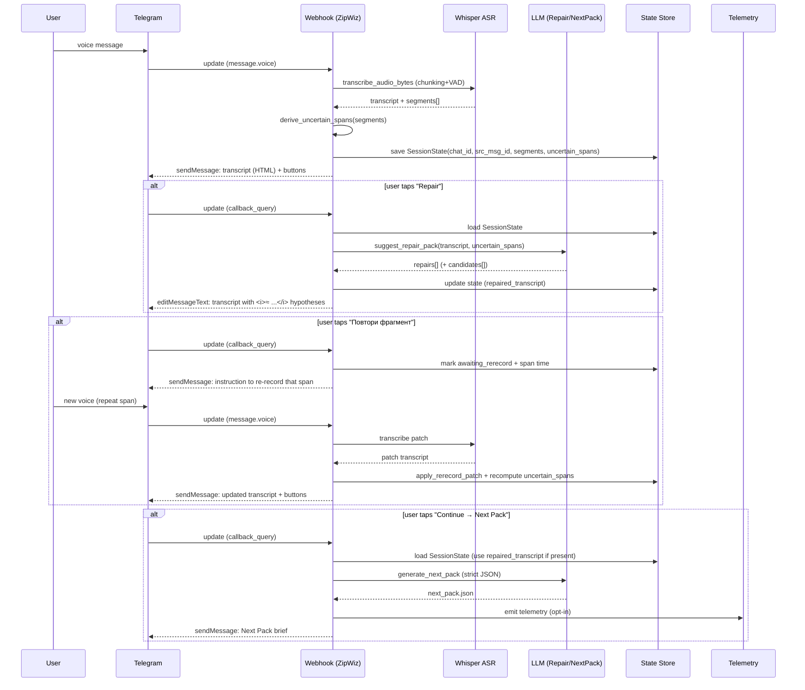

--------------------
File: /zipwiz-soul-scan 2/LICENSE
--------------------

MIT License

Copyright (c) 2025

Permission is hereby granted, free of charge, to any person obtaining a copy
of this software and associated documentation files (the "Software"), to deal
in the Software without restriction, including without limitation the rights
to use, copy, modify, merge, publish, distribute, sublicense, and/or sell
copies of the Software, and to permit persons to whom the Software is
furnished to do so, subject to the following conditions:

The above copyright notice and this permission notice shall be included in all
copies or substantial portions of the Software.

THE SOFTWARE IS PROVIDED "AS IS", WITHOUT WARRANTY OF ANY KIND, EXPRESS OR
IMPLIED, INCLUDING BUT NOT LIMITED TO THE WARRANTIES OF MERCHANTABILITY,
FITNESS FOR A PARTICULAR PURPOSE AND NONINFRINGEMENT. IN NO EVENT SHALL THE
AUTHORS OR COPYRIGHT HOLDERS BE LIABLE FOR ANY CLAIM, DAMAGES OR OTHER
LIABILITY, WHETHER IN AN ACTION OF CONTRACT, TORT OR OTHERWISE, ARISING FROM,
OUT OF OR IN CONNECTION WITH THE SOFTWARE OR THE USE OR OTHER DEALINGS IN THE
SOFTWARE.


--------------------
File: /zipwiz-soul-scan 2/pyproject.toml
--------------------

[project]
name = "zipwiz-soul-scan"
version = "0.1.0"
description = "Telegram-first Research OS starter: transcript→notes→routing→ledger; includes Soul Scan profiling"
requires-python = ">=3.10"

[tool.pytest.ini_options]
pythonpath = ["src"]


[project.optional-dependencies]
server = ["fastapi>=0.110", "uvicorn>=0.23", "jsonschema>=4.20"]
clients = []


--------------------
File: /zipwiz-soul-scan 2/tests/test_router.py
--------------------

def test_router_basic():
    from zipwiz.router import decide_route
    r = decide_route('hello')
    assert 0 <= r.complexity_score <= 1
    assert r.tier in (1,2,3)


--------------------
File: /zipwiz-soul-scan 2/docs/ASR_CHUNKING.md
--------------------

# ASR Chunking (Whisper / OpenAI Transcriptions)

This repo supports **long Telegram voice notes** by:
1) downloading the OGG/OPUS from Telegram,
2) converting to WAV (16kHz mono) with **ffmpeg**,
3) slicing into overlapping chunks,
4) transcribing each chunk via OpenAI `/v1/audio/transcriptions`,
5) stitching into one transcript + **segments[]** for telemetry.

## Why chunking helps
Long audio can fail or truncate due to request-size limits or model/runtime behavior. Chunking keeps each request small and yields stable partial results instead of “text unavailable”.

## Config (env)
- `ASR_MODEL` (default `gpt-4o-mini-transcribe`; alternative `whisper-1`)
- `ASR_LANGUAGE` (optional, e.g. `ru`)
- `ASR_CHUNK_SECONDS` (default `240`)
- `ASR_OVERLAP_SECONDS` (default `0.75`)
- `ASR_MAX_CHUNK_MIB` (default `10`) — conservative per-request cap

## Output
ASR returns:
- `transcript` (stitched)
- `status`: `success | partial | failed`
- `confidence` (heuristic)
- `segments[]`: list of `{index, start_ms, end_ms, text, ok, latency_ms, error}`

## Troubleshooting
### 1) “text unavailable” / empty transcript
- Check `OPENAI_API_KEY` is set
- Verify chunk sizes (`ASR_MAX_CHUNK_MIB`) — reduce to 8–10 MiB if needed
- Inspect telemetry: failed segments will have `error` populated.

### 2) ffmpeg missing
Chunking requires `ffmpeg` on PATH. Install it, or switch to a different ASR backend.

### 3) Boundary word cuts
We use a small overlap and a simple boundary de-duplication heuristic.
If you need higher quality stitching, increase overlap slightly (1.0–1.5s),
and consider smarter de-duplication (token-based).


--------------------
File: /zipwiz-soul-scan 2/docs/TELEGRAM_BOT_FLOW.md
--------------------

# Telegram Bot Flow (точно) — ASR + Repair + Re-record

ZipWiz работает в 2 слоя:

1) **ASR слой (Whisper)**: voice → transcript + `segments[]` + `uncertain_spans[]`
2) **Loop слой (Research OS)**: transcript → Next Pack (строгий JSON) → маршрутизация



## Кнопки MVP (voice)

**После ASR:**
- 🛠 **Восстановить смысл (гипотеза)** — показывает восстановленные фрагменты как *предположения*
- 🎙 **Повтори #N (mm:ss–mm:ss)** — попросить пользователя перезаписать конкретный проблемный фрагмент
- 🎙 **Перезапиши последние 15с** — быстрый вариант, если проблемный кусок ближе к концу
- ▶️ **Продолжить → Next Pack**

## Визуальная прозрачность в Telegram

Telegram **не поддерживает “меньший шрифт”**, поэтому используем понятные маркеры:

- **обычный текст** = распознано
- `<u>[НЕРАЗБОРЧИВО]</u>` = проблемный кусок (нет уверенности)
- `<i>≈ ...</i>` = *гипотеза восстановления* (не факт)

Это позволяет пользователю сразу видеть границу между **достоверным** и **предположенным**.

## Где это в коде
- `src/zipwiz/asr/openai_whisper.py` — Whisper (OpenAI API) + сегменты
- `src/zipwiz/asr/chunking.py` — chunking + VAD + склейка
- `src/zipwiz/asr/quality.py` — `derive_uncertain_spans()`
- `src/zipwiz/asr/repair.py` — Repair (LLM) → `repairs[]`
- `src/zipwiz/bot/webhook_app.py` — webhook + callback flow
- `src/zipwiz/bot/state_store.py` — SessionState (file-backed)
- `src/zipwiz/bot/ui_render.py` — HTML рендер + inline keyboard


--------------------
File: /zipwiz-soul-scan 2/docs/ARCHITECTURE.md
--------------------

# Architecture (high-level)

ZipWiz is a **closed-loop idea refinery**:

1. **Ingest**
   - Telegram voice note / text arrives
   - Voice → text (ASR), with confidence + retry/chunking for failures
   - Store raw audio *ephemerally* (optional) + store transcript

2. **Distill**
   - Convert transcript into:
     - Atomic Notes (facts / hypotheses / open questions)
     - Summary (short)
     - “Idea units” (sentence-level or paragraph-level segments)

3. **Route (Token Economy)**
   - A cheap classifier estimates: complexity, risk, novelty, domain
   - Route to model tiers:
     - Tier 0: rules/regex (free)
     - Tier 1: cheap/free LLMs (triage, formatting)
     - Tier 2: mid LLMs (good synthesis)
     - Tier 3: premium reasoning (“Thinking High”) for the top 1–5% cases
   - Always store routing decisions in the ledger.

4. **Synthesize**
   - Output a strict bundle (JSON):
     - Next Questions (technical + creative)
     - Wildcards
     - “Best Prompt Export” to paste into your deep model

5. **Learn (Two Pools)**
   - Technical pool: reproducible tasks, code, constraints, evals
   - Creative pool: cross-domain translations, metaphors, wildcards
   - Build your own loop-benchmark measuring **iteration quality**, not just one-shot answers.

6. **Governance**
   - Consent gates for telemetry + training data
   - Data minimization (store summaries/notes, not raw everything)
   - Data residency + region rollout as policy + enforcement (see docs)

Key artifact: **Reproducibility Ledger**
- Every step logs: prompt_id, model_id, context_hash, cost_estimate, output_hash, decision.


--------------------
File: /zipwiz-soul-scan 2/docs/OBBBA_AI_PROJECTS.md
--------------------

# One Big Beautiful Bill Act (H.R.1 / Public Law 119‑21) — что реально “про данные/ИИ”

Коротко: это огромный reconciliation‑пакет (налоги + расходы). Там есть конкретные “data‑sensitive” направления:
- ассигнования на AI/automation для ведомств (IT modernization)
- AI/ML в задачах контроля/инспекции/безопасности
- использование AI‑инструментов для выявления improper payments (health)

ZipWiz позиционируется не как “Singularity”, а как:
**orchestration + evaluation + telemetry + governance**.


--------------------
File: /zipwiz-soul-scan 2/docs/US_ONLY_ROLLOUT.md
--------------------

# US-only rollout & US data residency (high-level)

This doc describes **defensive** product controls: availability-by-region and US data residency.

## Availability / feature gating
- Feature flags: enable premium features only for eligible accounts
- Eligibility signals (imperfect, so treat as risk scoring):
  - billing country / tax country
  - phone verification
  - enterprise contracts
  - IP geo (weak signal)
- Enforcement happens server-side (clients are untrusted).

## Data residency
- Store and process sensitive data only in US cloud regions
- Policy-as-code:
  - block egress to non-US regions
  - key management in US region
  - access control + audit logs
- Separate “global app” from “restricted feature” backends.

## Reality check
Geo signals can be spoofed; what matters is:
- server-side control
- contractual + compliance posture
- monitoring and anomaly detection


--------------------
File: /zipwiz-soul-scan 2/docs/PLAN_7_DAYS.md
--------------------

# 7‑Day Plan (MVP delivery)

## Day 1 — Repo + Infra
- Configure `.env` and secrets handling (no hard-coded keys)
- Stand up local dev server (`uvicorn zipwiz.bot.webhook_app:app`)
- Add telemetry JSONL sink + rotation

## Day 2 — Telegram plumbing
- Create bot, set webhook, validate secret token header
- Parse updates: text + voice metadata, UI buttons (inline keyboard)

## Day 3 — ASR integration (voice → text)
- Plug Whisper (local) or chosen ASR provider
- Chunking + retry strategy, confidence reporting

## Day 4 — Next Pack (Structured Outputs) end‑to‑end
- Implement `next_pack.schema.json` validation
- Wire OpenAI Responses Structured Outputs / OpenRouter JSON schema
- Add fallback: if strict output fails → re-ask with repair prompt

## Day 5 — Router v1 + budgets
- Complexity + pool classifier improvements
- Per-user/per-chat budget rules + “Deep Dive” explicit spend
- Caching by (context_hash, prompt_hash)

## Day 6 — Security hardening (legit layers)
- mTLS / TLS config, WAF basics, rate limiting
- Encryption at rest (KMS) + least privilege (RBAC)
- Audit logs, incident checklist, secrets rotation

## Day 7 — Demo pack
- Government one-pager + mermaid diagram
- Recorded demo flow (voice → next pack → export)
- LOOPBENCH v0 run + metrics report (latency/cost/schema adherence)


--------------------
File: /zipwiz-soul-scan 2/docs/TOKEN_ECONOMY.md
--------------------

# Token Economy: “Spend the expensive tokens only when it matters”

## The pattern: Cascade + Gating
1) **Cheap triage** does:
- language detection
- de-dup / similarity
- basic extraction (entities, tasks, code blocks)
- risk flags (privacy, self-harm, illegal requests)

2) **Escalation rules** (examples)
Escalate to premium reasoning if any of these are true:
- the user explicitly requests “deep” output
- the task has many constraints / steps
- the output must be safety-critical (security design, legal/medical flags)
- low confidence from cheaper models
- high novelty / high expected value (“this could be a breakthrough”)

3) **Caching**
- Cache deterministic transforms (transcript cleanup, formatting)
- Cache retrieval results (vector search)
- Cache repeated questions (prompt hash)

4) **Budgeting knobs**
- user setting: “Ideas per sentence” (1–3) and “Max spend/day”
- system setting: “premium escalation quota” per user per hour/day

## Technical vs Creative Pools
- Technical: reward for correctness, reproducibility, testability
- Creative: reward for novelty, transfer, surprise

You keep both, because breakthrough products require both.


--------------------
File: /zipwiz-soul-scan 2/docs/SECURITY_SHIELDS.md
--------------------

# Safety shields (defense-in-depth)

This is about **protecting user data** and ensuring **reliable operation**, not hiding wrongdoing.

## Shield layers
1) Consent shield (users choose)
2) Redaction shield (strip secrets before logs)
3) Storage shield (encryption at rest; short retention for raw)
4) Access shield (least privilege; audited access)
5) Compute shield (confidential computing where appropriate)
6) Egress shield (block data leaving approved regions)
7) Supply-chain shield (dependency pinning; SBOM)
8) Incident shield (monitoring + runbooks + keys rotation)


--------------------
File: /zipwiz-soul-scan 2/docs/MODEL_ROUTER_POLICY.md
--------------------

# Model Router Policy v1 (коротко)

- Дешёвые модели: чистка/структурирование/первичный Next Pack
- Премиум: только по кнопке “Deep Dive” или когда complexity высокий
- Метрики: latency, schema‑adherence, user‑rating, cost per insight
- Два пула: Technical / Creative (разные промпты и критерии качества)


--------------------
File: /zipwiz-soul-scan 2/docs/TELEMETRY_SCHEMA_V1.md
--------------------

# Telemetry schema v1 (privacy-first)

Principle: **collect for user benefit**, not surveillance.

## Event categories
- `ingest.*` (message received, transcript produced)
- `distill.*` (summary/atomic notes created)
- `route.*` (complexity score, model tier decision)
- `model.*` (request/response metadata, NOT raw content unless user opts in)
- `benchmark.*` (task created, scored, iteration metrics)
- `privacy.*` (consent updated, data deleted/exported)

## What not to collect by default
- Raw audio beyond short retention
- “Full chat transcript forever”
- Device fingerprinting / hidden identifiers

## Consent gates
- `consent.analytics` (basic product analytics)
- `consent.research_share` (optional: share content for improving tasks/models)
- `consent.raw_audio_retention` (optional: keep raw voice for later analysis)

See `schemas/telemetry_events.schema.json`.


## ASR quality signals (additions)
- `uncertain_spans[]`: derived spans (ms ranges) where ASR is low-confidence / missing / errored.
  Use this to drive UI actions like “repeat only the problematic fragment”.


--------------------
File: /zipwiz-soul-scan 2/docs/SOUL_SCAN.md
--------------------

# ZipWiz Soul Scan (behavioral profile)

“Soul Scan” = a standardized battery of prompts + metrics that profiles a model’s:
- **tone** and conversational style
- **constraint boundaries** (what it refuses, how it refuses)
- **strengths** (math, code, planning, creativity)
- **failure modes** (hallucination, overconfidence, verbosity)
- **tool discipline** (stays structured, follows schema)

This is not metaphysics. It’s evaluation.

## Output artifact
- A JSON “model card supplement” stored in your ledger
- A comparable vector embedding for clustering model personalities

## Prompt battery (examples)
1) “Summarize this messy transcript into atomic notes.”
2) “Generate 10 questions; rank by expected value.”
3) “Given constraints, propose minimal viable experiment.”
4) “Refuse a disallowed request safely and helpfully.”
5) “Translate idea across domains: sound → geometry → code.”

## Metrics
- schema adherence rate
- self-consistency (same input, stable output)
- refusal quality (helpful redirect)
- compression quality (retain key decisions)
- novelty score (creative pool only)


--------------------
File: /zipwiz-soul-scan 2/docs/DATA_POOLS.md
--------------------

# Two Data Pools: Technical vs Creative

## Technical pool
Stored units:
- problem statements
- constraints
- code snippets
- test cases
- evaluation rubrics
- model outputs + pass/fail

Good sources:
- your own tasks
- public bug reports / issues (with licenses)
- synthetic tasks generated by models + verified by tests

## Creative pool
Stored units:
- metaphors / analogies
- cross-domain translations
- wildcards + “surprise” results
- naming/vocabulary

Good sources:
- your own voice ideation
- public-domain texts
- synthetic idea trees (model-generated)

## Bridge objects
- “Idea Graph” nodes linking creative → technical tasks


--------------------
File: /zipwiz-soul-scan 2/docs/ETHICS_AND_COMPLIANCE.md
--------------------

# Ethics & compliance notes (important)

## 1) UI automation to dodge API limits
If you automate a provider’s website UI (instead of using the API) to evade rate limits or restrictions,
that is commonly against Terms of Service and can be unethical. Use official APIs, negotiate higher limits,
or design a token-economy router to stay within budgets.

## 2) Telemetry / “cookies” / device fingerprinting
Do not collect hidden device identifiers “so users won’t notice.”
Instead:
- ask permission clearly
- collect the minimum needed
- give users a delete/export button
- use privacy-preserving techniques (aggregation, hashing with salt, short retention)

## 3) “US-only” rollout
If you restrict availability by region, do it transparently:
- server-side feature flags
- app store availability + account eligibility checks
- data residency policies and enforcement

Always consult legal counsel for sanctions/export/compliance requirements.


--------------------
File: /zipwiz-soul-scan 2/docs/GOV_ONE_PAGER.md
--------------------

# ZipWiz — Voice‑to‑Research OS (MVP за 7 дней) — One‑Pager

## Проблема
Команды теряют сигнал в голосовых/чатах: идеи расползаются, контекст тонет, а использование нескольких LLM становится дорогим и плохо управляемым.

## Решение
**ZipWiz** — это **слой оркестрации + измерения**:
- Telegram voice/text → транскрипт → **структурированные “research units”**
- **Маршрутизация** по моделям (дешёвая → эскалация на премиум только когда нужно)
- **Два пула данных**: Technical vs Creative
- **Телеметрия по согласию**: latency/cost/schema‑adherence/ошибки (без скрытого профилирования)

## Что именно поставляем за 7 дней (MVP)
1) Telegram webhook + обработчик updates
2) ASR слой (пока stub в коде; подключаем Whisper/облачный ASR)
3) Генерация **Next Pack** со строгой JSON‑схемой
4) Router v1: complexity scoring + budget правила
5) Telemetry v1: JSONL events + schema validation
6) Export: Markdown + JSON bundle

## Почему проект “data-sensitive” и как закрываем риски
- Голос/текст может содержать PII/секреты → **Private Mode по умолчанию**
- Шифрование in-transit + at-rest, least privilege, аудит
- Явный opt‑in на “Share Mode” (улучшение маршрутизации/бенчмарков)

## Что можно пилотировать/финансировать
- Pilot cohort (агентство/лаборатория/университет)
- “Which model for which task” карта на реальных задачах
- Измеримый эффект: cost/latency/quality vs baseline single-model


--------------------
File: /zipwiz-soul-scan 2/docs/OPENROUTER_COMPLIANCE.md
--------------------

# OpenRouter compliance (важно)

ZipWiz **не** должен:
- скрейпить сайт
- обходить rate limits/технические меры
- нарушать ToS провайдеров моделей

ZipWiz должен:
- использовать официальный API
- backoff + очередь + кэш
- проверять лимиты/кредиты через endpoint key info


--------------------
File: /zipwiz-soul-scan 2/docs/BENCHMARK_FORGE.md
--------------------

# Benchmark Forge: build an ARC-like benchmark for *loops*

Classic benchmarks test one-shot answers.
ZipWiz benchmarks test **iteration quality**.

## Task families
- Plan-from-voice: voice note → research plan in 3 steps
- Question power: generate questions that reduce uncertainty fastest
- Context compression: shrink context while preserving decisions
- Cross-domain translation: reframe idea in 3 domains
- Reproducibility: produce experiment + expected outputs + evaluation rubric

## Two pools
- Technical benchmark set (correctness + reproducibility)
- Creative benchmark set (novelty + transfer + coherence)

## Scoring
- Human-in-the-loop rubric + pairwise preference data
- Automated checks (schema validity, test pass rates, dedupe)


--------------------
File: /zipwiz-soul-scan 2/docs/CB_ARCHITECTURE_DIAGRAM.md
--------------------

# CB Architecture (Mermaid)

```mermaid
flowchart LR
  U[Telegram User] --> I[Ingest]
  I --> ASR[ASR]
  ASR --> T[Transcript]
  T --> D[Distiller]
  D --> TP[(Technical Pool)]
  D --> CP[(Creative Pool)]
  D --> Q[Next Pack Generator]
  Q --> R[Router Policy]
  R --> C1[Cheap/Mid Models]
  R --> C2[Premium Models]
  C1 --> O[Outputs]
  C2 --> O
  O --> L[Repro Ledger]
  O --> X[Telemetry (opt-in)]
  L --> Q
```

CB = routing + memory + evaluation. Не “AGI”, а мета‑система управления циклами.


--------------------
File: /zipwiz-soul-scan 2/schemas/asr_repair_pack.schema.json
--------------------

{
  "$schema": "https://json-schema.org/draft/2020-12/schema",
  "title": "ZipWiz ASR Repair Pack",
  "type": "object",
  "required": [
    "disclaimer",
    "candidates"
  ],
  "properties": {
    "disclaimer": {
      "type": "string"
    },
    "candidates": {
      "type": "array",
      "minItems": 1,
      "maxItems": 5,
      "items": {
        "type": "object",
        "required": [
          "text",
          "confidence",
          "rationale"
        ],
        "properties": {
          "text": {
            "type": "string"
          },
          "confidence": {
            "type": "number",
            "minimum": 0,
            "maximum": 1
          },
          "rationale": {
            "type": "string"
          }
        }
      }
    },
    "repairs": {
      "type": "array",
      "minItems": 0,
      "maxItems": 50,
      "items": {
        "type": "object",
        "required": [
          "span_id",
          "replacement",
          "confidence",
          "rationale"
        ],
        "properties": {
          "span_id": {
            "type": "integer",
            "minimum": 0
          },
          "replacement": {
            "type": "string"
          },
          "confidence": {
            "type": "number",
            "minimum": 0,
            "maximum": 1
          },
          "rationale": {
            "type": "string"
          }
        }
      }
    }
  }
}

--------------------
File: /zipwiz-soul-scan 2/schemas/telemetry_events.schema.json
--------------------

{
  "$schema": "https://json-schema.org/draft/2020-12/schema",
  "title": "ZipWiz Telemetry Events v1",
  "type": "object",
  "properties": {
    "event_id": {
      "type": "string",
      "description": "UUID"
    },
    "ts": {
      "type": "string",
      "format": "date-time"
    },
    "event_type": {
      "type": "string"
    },
    "user_id": {
      "type": "string",
      "description": "Pseudonymous user id (salted hash)"
    },
    "session_id": {
      "type": "string"
    },
    "consent": {
      "type": "object",
      "properties": {
        "analytics": {
          "type": "boolean"
        },
        "research_share": {
          "type": "boolean"
        },
        "raw_audio_retention": {
          "type": "boolean"
        }
      },
      "required": [
        "analytics",
        "research_share",
        "raw_audio_retention"
      ]
    },
    "model": {
      "type": "object",
      "properties": {
        "provider": {
          "type": "string"
        },
        "model_id": {
          "type": "string"
        },
        "tier": {
          "type": "integer",
          "minimum": 0,
          "maximum": 3
        },
        "input_tokens_est": {
          "type": "integer",
          "minimum": 0
        },
        "output_tokens_est": {
          "type": "integer",
          "minimum": 0
        },
        "cost_usd_est": {
          "type": "number",
          "minimum": 0
        }
      }
    },
    "routing": {
      "type": "object",
      "properties": {
        "complexity_score": {
          "type": "number",
          "minimum": 0,
          "maximum": 1
        },
        "novelty_score": {
          "type": "number",
          "minimum": 0,
          "maximum": 1
        },
        "risk_flags": {
          "type": "array",
          "items": {
            "type": "string"
          }
        },
        "pool": {
          "type": "string",
          "enum": [
            "technical",
            "creative",
            "mixed"
          ]
        },
        "ideas_per_unit": {
          "type": "integer",
          "minimum": 1,
          "maximum": 3
        }
      }
    },
    "content": {
      "type": "object",
      "properties": {
        "input_hash": {
          "type": "string"
        },
        "output_hash": {
          "type": "string"
        },
        "transcript_confidence": {
          "type": "number",
          "minimum": 0,
          "maximum": 1
        },
        "asr": {
          "type": "object",
          "properties": {
            "has_voice": {
              "type": "boolean"
            },
            "status": {
              "type": "string"
            },
            "model": {
              "type": "string"
            },
            "language": {
              "type": [
                "string",
                "null"
              ]
            },
            "duration_s": {
              "type": [
                "number",
                "null"
              ]
            },
            "chunk_seconds": {
              "type": [
                "number",
                "null"
              ]
            },
            "overlap_seconds": {
              "type": [
                "number",
                "null"
              ]
            },
            "raw_audio_path": {
              "type": [
                "string",
                "null"
              ]
            },
            "segments": {
              "type": "array",
              "items": {
                "type": "object",
                "properties": {
                  "index": {
                    "type": "integer"
                  },
                  "start_ms": {
                    "type": "integer"
                  },
                  "end_ms": {
                    "type": "integer"
                  },
                  "text": {
                    "type": "string"
                  },
                  "ok": {
                    "type": "boolean"
                  },
                  "latency_ms": {
                    "type": [
                      "integer",
                      "null"
                    ]
                  },
                  "error": {
                    "type": [
                      "string",
                      "null"
                    ]
                  }
                },
                "required": [
                  "index",
                  "start_ms",
                  "end_ms",
                  "text",
                  "ok"
                ]
              }
            },
            "uncertain_spans": {
              "type": "array",
              "items": {
                "type": "object",
                "required": [
                  "span_id",
                  "start_ms",
                  "end_ms",
                  "reason"
                ],
                "properties": {
                  "span_id": {
                    "type": "integer"
                  },
                  "start_ms": {
                    "type": "integer",
                    "minimum": 0
                  },
                  "end_ms": {
                    "type": "integer",
                    "minimum": 0
                  },
                  "reason": {
                    "type": "string"
                  },
                  "segment_index": {
                    "type": [
                      "integer",
                      "null"
                    ]
                  }
                }
              }
            }
          }
        }
      }
    },
    "ledger": {
      "type": "object",
      "properties": {
        "prompt_id": {
          "type": "string"
        },
        "context_hash": {
          "type": "string"
        },
        "decision": {
          "type": "string"
        }
      }
    }
  },
  "required": [
    "event_id",
    "ts",
    "event_type",
    "user_id",
    "session_id",
    "consent"
  ]
}

--------------------
File: /zipwiz-soul-scan 2/schemas/consent_snapshot.schema.json
--------------------

{
  "$schema": "https://json-schema.org/draft/2020-12/schema",
  "title": "ZipWiz Consent Snapshot v1",
  "type": "object",
  "properties": {
    "user_id": {
      "type": "string"
    },
    "ts": {
      "type": "string",
      "format": "date-time"
    },
    "analytics": {
      "type": "boolean"
    },
    "research_share": {
      "type": "boolean"
    },
    "raw_audio_retention": {
      "type": "boolean"
    },
    "notes": {
      "type": "string"
    }
  },
  "required": [
    "user_id",
    "ts",
    "analytics",
    "research_share",
    "raw_audio_retention"
  ]
}

--------------------
File: /zipwiz-soul-scan 2/schemas/soul_scan_result.schema.json
--------------------

{
  "$schema": "https://json-schema.org/draft/2020-12/schema",
  "title": "ZipWiz Soul Scan Result v1",
  "type": "object",
  "properties": {
    "model_id": {
      "type": "string"
    },
    "provider": {
      "type": "string"
    },
    "ts": {
      "type": "string",
      "format": "date-time"
    },
    "battery_version": {
      "type": "string"
    },
    "scores": {
      "type": "object",
      "properties": {
        "schema_adherence": {
          "type": "number",
          "minimum": 0,
          "maximum": 1
        },
        "compression_quality": {
          "type": "number",
          "minimum": 0,
          "maximum": 1
        },
        "refusal_quality": {
          "type": "number",
          "minimum": 0,
          "maximum": 1
        },
        "novelty": {
          "type": "number",
          "minimum": 0,
          "maximum": 1
        },
        "self_consistency": {
          "type": "number",
          "minimum": 0,
          "maximum": 1
        }
      }
    },
    "notes": {
      "type": "string"
    },
    "artifacts": {
      "type": "object",
      "properties": {
        "model_style_tags": {
          "type": "array",
          "items": {
            "type": "string"
          }
        },
        "failure_modes": {
          "type": "array",
          "items": {
            "type": "string"
          }
        },
        "best_use_cases": {
          "type": "array",
          "items": {
            "type": "string"
          }
        }
      }
    }
  },
  "required": [
    "model_id",
    "provider",
    "ts",
    "battery_version",
    "scores"
  ]
}

--------------------
File: /zipwiz-soul-scan 2/schemas/next_pack.schema.json
--------------------

{
  "$schema": "https://json-schema.org/draft/2020-12/schema",
  "title": "ZipWiz Next Pack",
  "type": "object",
  "required": [
    "transcript",
    "confidence",
    "summary_bullets",
    "atomic_notes",
    "next_questions",
    "wildcards",
    "best_prompt_export",
    "routing_hint"
  ],
  "properties": {
    "transcript": {
      "type": "string"
    },
    "confidence": {
      "type": "number",
      "minimum": 0,
      "maximum": 1
    },
    "summary_bullets": {
      "type": "array",
      "items": {
        "type": "string"
      },
      "minItems": 3,
      "maxItems": 7
    },
    "atomic_notes": {
      "type": "array",
      "items": {
        "type": "object",
        "required": [
          "text",
          "pool",
          "tags"
        ],
        "properties": {
          "text": {
            "type": "string"
          },
          "pool": {
            "type": "string",
            "enum": [
              "technical",
              "creative"
            ]
          },
          "tags": {
            "type": "array",
            "items": {
              "type": "string"
            }
          }
        }
      }
    },
    "next_questions": {
      "type": "array",
      "minItems": 6,
      "maxItems": 15,
      "items": {
        "type": "object",
        "required": [
          "question",
          "category",
          "difficulty"
        ],
        "properties": {
          "question": {
            "type": "string"
          },
          "category": {
            "type": "string",
            "enum": [
              "clarify",
              "invert",
              "translate",
              "next_step",
              "verify",
              "risk"
            ]
          },
          "difficulty": {
            "type": "integer",
            "minimum": 1,
            "maximum": 5
          }
        }
      }
    },
    "wildcards": {
      "type": "array",
      "items": {
        "type": "string"
      },
      "minItems": 2,
      "maxItems": 5
    },
    "best_prompt_export": {
      "type": "string"
    },
    "routing_hint": {
      "type": "object",
      "required": [
        "preferred_pool",
        "complexity",
        "recommended_tier"
      ],
      "properties": {
        "preferred_pool": {
          "type": "string",
          "enum": [
            "technical",
            "creative",
            "mixed"
          ]
        },
        "complexity": {
          "type": "integer",
          "minimum": 1,
          "maximum": 5
        },
        "recommended_tier": {
          "type": "string",
          "enum": [
            "cheap",
            "mid",
            "premium"
          ]
        }
      }
    },
    "transcription_status": {
      "type": "string",
      "enum": [
        "success",
        "partial",
        "failed"
      ]
    },
    "asr_segments": {
      "type": "array",
      "items": {
        "type": "object",
        "properties": {
          "index": {
            "type": "integer"
          },
          "start_ms": {
            "type": "integer"
          },
          "end_ms": {
            "type": "integer"
          },
          "text": {
            "type": "string"
          },
          "ok": {
            "type": "boolean"
          },
          "latency_ms": {
            "type": [
              "integer",
              "null"
            ]
          },
          "error": {
            "type": [
              "string",
              "null"
            ]
          }
        },
        "required": [
          "index",
          "start_ms",
          "end_ms",
          "text",
          "ok"
        ]
      }
    }
  }
}

--------------------
File: /zipwiz-soul-scan 2/README.md
--------------------

# ZipWiz Soul Scan (starter repo)

This repo is a **starter blueprint** for building a Telegram-first “Research OS”:
voice → transcript → structured notes → adaptive next-questions → multi-model routing → reproducibility ledger.

It also includes a **Soul Scan** concept: a *behavioral profile* for each model (style, strengths, failure modes, constraint boundaries),
without claiming anything metaphysical.

## What this repo is (and is not)
- ✅ **Is**: architecture + telemetry schema + safe-by-default privacy controls + token-economy routing patterns.
- ❌ **Is not**: a “bypass” for other services, rate limits, UI restrictions, or a stealth data-collection kit.

## Non‑negotiables
- **No stealth collection**: you must inform users what you collect, and get consent.
- **Respect provider ToS**: use official APIs, not automated scraping of provider UIs.
- **Safety/legality**: no “signal jamming”, no covert surveillance, no instructions to evade governments or laws.

## Quick structure
- `docs/` — product strategy + privacy + geo rollout guidance
- `schemas/` — JSON Schemas for telemetry/events/consent
- `src/zipwiz/` — minimal Python skeleton for ingestion → routing → logging
- `scripts/` — small utilities (simulate event flow, pricing snapshot stubs)

## How to use
1. Read `docs/ARCHITECTURE.md` and `docs/TOKEN_ECONOMY.md`
2. Start by implementing:
   - `zipwiz/ingest.py` (Telegram webhook → storage)
   - `zipwiz/router.py` (cheap→expensive cascade)
   - `zipwiz/events.py` (telemetry + redaction)
3. Keep everything reproducible via the “ledger” (`event_id`, `context_hash`, `model_id`).

## Date
Generated on 2025-12-22.


## Added (Dec 2025)
- docs/GOV_ONE_PAGER.md
- docs/TELEGRAM_BOT_FLOW.md
- docs/CB_ARCHITECTURE_DIAGRAM.md
- docs/MODEL_ROUTER_POLICY.md
- docs/OPENROUTER_COMPLIANCE.md
- docs/OBBBA_AI_PROJECTS.md
- schemas/next_pack.schema.json
- src/zipwiz/bot/webhook_app.py (FastAPI optional)
- src/zipwiz/pipeline.py
- src/zipwiz/telemetry.py


## ASR (Whisper) + chunking
- See `docs/ASR_CHUNKING.md`
- Script: `scripts/transcribe_file_openai_chunked.py`


## ASR Repair + Re-record UX (Dec 2025)
- Voice транскрипт отдаётся с `segments[]` + `uncertain_spans[]` и кнопками для Repair/перезаписи фрагмента.
- Смотри `docs/TELEGRAM_BOT_FLOW.md` и `src/zipwiz/bot/webhook_app.py`.
- `TELEGRAM_SEND_MODE=payload|api` управляет тем, делает ли webhook реальные вызовы Telegram API.


--------------------
File: /zipwiz-soul-scan 2/.gitignore
--------------------

__pycache__/
.env
*.pyc
*.zip

# Runtime state
var/


--------------------
File: /zipwiz-soul-scan 2/benchmarks/LOOPBENCH_TASKS.md
--------------------

# LOOPBENCH (ARC‑adjacent, legal)

Not about “breaking ARC”. It's about measuring **iteration quality**.

Families:
A) Voice→Plan (3 iterations)
B) Two‑Pool Separation
C) Routing Under Budget
D) Cross‑domain Translation

All outputs must follow `schemas/next_pack.schema.json` so scoring is automatic.


--------------------
File: /zipwiz-soul-scan 2/scripts/transcribe_file_openai_chunked.py
--------------------

#!/usr/bin/env python3
from __future__ import annotations

import os
import sys
from pathlib import Path

from zipwiz.asr import transcribe_audio_bytes
from zipwiz.asr.chunking import ChunkingConfig

def main() -> int:
    if len(sys.argv) < 2:
        print("Usage: transcribe_file_openai_chunked.py <audio_file_path>")
        return 2

    p = Path(sys.argv[1])
    if not p.exists():
        print(f"File not found: {p}")
        return 2

    api_key = os.getenv("OPENAI_API_KEY")
    if not api_key:
        print("Missing OPENAI_API_KEY")
        return 2

    audio_bytes = p.read_bytes()

    cfg = ChunkingConfig(
        chunk_seconds=float(os.getenv("ASR_CHUNK_SECONDS", "240")),
        overlap_seconds=float(os.getenv("ASR_OVERLAP_SECONDS", "0.75")),
        max_chunk_mib=float(os.getenv("ASR_MAX_CHUNK_MIB", "10")),
    )

    res = transcribe_audio_bytes(
        audio_bytes=audio_bytes,
        filename=p.name,
        openai_api_key=api_key,
        model=os.getenv("ASR_MODEL", "gpt-4o-mini-transcribe"),
        language=os.getenv("ASR_LANGUAGE") or None,
        cfg=cfg,
    )

    print("STATUS:", res.status)
    print("CONF:", res.confidence)
    print("\n--- TRANSCRIPT ---\n")
    print(res.transcript)
    print("\n--- SEGMENTS (count=%d) ---" % len(res.segments))
    for s in res.segments[:10]:
        print(s)
    if len(res.segments) > 10:
        print("...")

    return 0

if __name__ == "__main__":
    raise SystemExit(main())


--------------------
File: /zipwiz-soul-scan 2/scripts/simulate_event_flow.py
--------------------

"""Simulate an end-to-end event flow (no external APIs).

Run:
  python scripts/simulate_event_flow.py
"""

from zipwiz.router import decide_route
from zipwiz.events import make_event, serialize_event

sample = (
    "Voice transcript: We should build a Telegram bot that outputs JSON bundles and routes expensive models only when needed. "
    "Also we want a Soul Scan battery and a reproducibility ledger."
)

route = decide_route(sample, user_max_ideas=3)
print("RouteDecision:", route)

evt = make_event(
    event_id="demo-1",
    event_type="route.decision",
    user_id="user_demo",
    session_id="session_demo",
    consent={"analytics": True, "research_share": False, "raw_audio_retention": False},
    routing={
        "complexity_score": route.complexity_score,
        "novelty_score": route.novelty_score,
        "risk_flags": [],
        "pool": route.pool,
        "ideas_per_unit": route.ideas_per_unit,
    },
    ledger={"prompt_id": "prompt_demo", "context_hash": "ctx_demo", "decision": "escalate_if_needed"},
)
print("Telemetry event JSON:")
print(serialize_event(evt))


--------------------
File: /zipwiz-soul-scan 2/scripts/pricing_snapshot.yaml
--------------------

# Pricing Snapshot Stub
# Store provider pricing and context limits as *time-stamped metadata* so you can:
# - estimate cost per route
# - compare model economics
# - reproduce benchmark runs later

as_of: 2025-12-22
providers:
  openai:
    notes: "Fill from official pricing page / invoices"
  openrouter:
    notes: "OpenRouter often passes through provider pricing; confirm on their pricing page"


--------------------
File: /zipwiz-soul-scan 2/prompts/ROLE_PACK.md
--------------------

# Role Pack (prompts)

## Distiller
Convert transcript into atomic notes; tag each note as technical/creative; output strict JSON.

## Question‑Smith
Generate testable questions (max 10) with categories: clarify/invert/translate/next_step/verify/risk.

## Wildcarder
3 cross-domain reframes.

## Skeptic
Find weak assumptions + 2 falsification ideas.

## Exporter
Produce one tight “premium model” prompt with objective, constraints, what’s known, what to decide next.


--------------------
File: /zipwiz-soul-scan 2/.env.example
--------------------

# ZipWiz example environment

# --- Providers ---
OPENAI_STORE=false

OPENAI_API_KEY=
OPENROUTER_API_KEY=

# --- Telegram ---
TELEGRAM_BOT_TOKEN=
TELEGRAM_WEBHOOK_SECRET=

# --- LLM (Next Pack) ---
LLM_MODEL=gpt-4o-mini

# --- ASR (OpenAI Transcriptions) ---
ASR_MODEL=gpt-4o-mini-transcribe   # or whisper-1
ASR_LANGUAGE=ru                    # optional
ASR_CHUNK_SECONDS=240
ASR_OVERLAP_SECONDS=0.75
ASR_MAX_CHUNK_MIB=10

# --- Storage paths (optional) ---
ZIPWIZ_TELEMETRY_PATH=var/telemetry/events.jsonl
ZIPWIZ_AUDIO_DIR=var/audio

# Telegram send mode: payload (return JSON) or api (call Telegram API)
TELEGRAM_SEND_MODE=payload

# --- ASR Repair (hypotheses) ---
ASR_REPAIR_ENABLED=false
ASR_REPAIR_MODEL=gpt-4o-mini
ASR_REPAIR_CANDIDATES=3

# --- Raw audio retention ---
STORE_RAW_AUDIO_HOURS=0


--------------------
File: /zipwiz-soul-scan 2/src/zipwiz/geo.py
--------------------

# Region gating is policy + enforcement.
# Clients can lie; enforcement must be server-side.

def is_region_allowed(region_code: str, allowed_regions: tuple[str, ...]) -> bool:
    return region_code in allowed_regions


--------------------
File: /zipwiz-soul-scan 2/src/zipwiz/redaction.py
--------------------

import re

# Very basic redaction helpers. In real life, use a proper DLP system.
SECRET_PATTERNS = [
    re.compile(r"sk-[A-Za-z0-9]{10,}")  # example API key-like pattern
]


def redact(text: str) -> str:
    out = text
    for pat in SECRET_PATTERNS:
        out = pat.sub("[REDACTED]", out)
    return out


--------------------
File: /zipwiz-soul-scan 2/src/zipwiz/llm/openrouter_client.py
--------------------

from __future__ import annotations

import json
import os
import time
import urllib.request

from .base import LLMResult

OPENROUTER_URL = "https://openrouter.ai/api/v1/chat/completions"

class OpenRouterClient:
    """Minimal OpenRouter client (OpenAI-compatible chat/completions endpoint).

    NOTE: Respect OpenRouter Terms + rate limits. Do not scrape/bypass.
    """

    def __init__(self, api_key: str | None = None):
        self.api_key = api_key or os.getenv("OPENROUTER_API_KEY")
        if not self.api_key:
            raise ValueError("OPENROUTER_API_KEY is missing")

    def generate_json(self, *, model: str, system: str, user: str, json_schema: dict, temperature: float = 0.2) -> LLMResult:
        payload = {
            "model": model,
            "messages": [
                {"role": "system", "content": system},
                {"role": "user", "content": user},
            ],
            # Many OpenRouter providers support OpenAI JSON Schema response_format.
            "response_format": {
                "type": "json_schema",
                "json_schema": {
                    "name": "zipwiz_next_pack",
                    "schema": json_schema,
                    "strict": True
                }
            },
            "temperature": temperature,
        }

        data = json.dumps(payload).encode("utf-8")
        req = urllib.request.Request(
            OPENROUTER_URL,
            data=data,
            headers={
                "Authorization": f"Bearer {self.api_key}",
                "Content-Type": "application/json",
            },
            method="POST",
        )

        t0 = time.time()
        with urllib.request.urlopen(req, timeout=60) as resp:
            raw = resp.read().decode("utf-8")
        latency_ms = int((time.time() - t0) * 1000)

        j = json.loads(raw)
        out_text = ""
        out_json = None
        try:
            out_text = j["choices"][0]["message"]["content"]
            # If provider returns JSON string, parse it:
            try:
                out_json = json.loads(out_text)
            except Exception:
                out_json = None
        except Exception:
            out_text = raw

        return LLMResult(provider="openrouter", model_id=model, output_text=out_text, output_json=out_json, latency_ms=latency_ms)


--------------------
File: /zipwiz-soul-scan 2/src/zipwiz/llm/openai_responses.py
--------------------

from __future__ import annotations

import json
import os
import time
import urllib.request
from typing import Any

from .base import LLMResult

OPENAI_RESPONSES_URL = "https://api.openai.com/v1/responses"

class OpenAIResponsesClient:
    """Minimal OpenAI Responses API client using stdlib (no extra deps).
    Uses Structured Outputs via `text.format` (json_schema).

    Notes:
    - Set `store: false` for privacy-first mode when desired.
    - You must supply OPENAI_API_KEY in env or pass it explicitly.
    """

    def __init__(self, api_key: str | None = None, store: bool = False):
        self.api_key = api_key or os.getenv("OPENAI_API_KEY")
        self.store = store
        if not self.api_key:
            raise ValueError("OPENAI_API_KEY is missing")

    def generate_json(self, *, model: str, system: str, user: str, json_schema: dict, temperature: float = 0.2) -> LLMResult:
        payload = {
            "model": model,
            "store": bool(self.store),
            "input": [
                {"role": "system", "content": system},
                {"role": "user", "content": user},
            ],
            # Structured Outputs in Responses API:
            "text": {
                "format": {
                    "type": "json_schema",
                    "json_schema": {
                        "name": "zipwiz_next_pack",
                        "schema": json_schema,
                        "strict": True
                    }
                }
            },
            "temperature": temperature,
        }

        data = json.dumps(payload).encode("utf-8")
        req = urllib.request.Request(
            OPENAI_RESPONSES_URL,
            data=data,
            headers={
                "Authorization": f"Bearer {self.api_key}",
                "Content-Type": "application/json",
            },
            method="POST",
        )

        t0 = time.time()
        with urllib.request.urlopen(req, timeout=60) as resp:
            raw = resp.read().decode("utf-8")
        latency_ms = int((time.time() - t0) * 1000)

        j = json.loads(raw)

        # Best-effort: extract the first text output. (Response shapes evolve; keep tolerant.)
        out_text = json.dumps(j, ensure_ascii=False)
        out_json = None
        try:
            # Typical Responses API: output[].content[] items
            out = j.get("output", [])
            for item in out:
                for c in item.get("content", []):
                    if c.get("type") in ("output_text", "text"):
                        out_text = c.get("text", out_text)
                    if c.get("type") == "output_json":
                        out_json = c.get("json")
        except Exception:
            pass

        return LLMResult(provider="openai", model_id=model, output_text=out_text, output_json=out_json, latency_ms=latency_ms)


--------------------
File: /zipwiz-soul-scan 2/src/zipwiz/llm/__init__.py
--------------------


--------------------
File: /zipwiz-soul-scan 2/src/zipwiz/llm/base.py
--------------------

from __future__ import annotations

from dataclasses import dataclass
from typing import Any, Protocol

@dataclass
class LLMResult:
    provider: str
    model_id: str
    output_text: str
    output_json: dict | None = None
    latency_ms: int | None = None

class LLMClient(Protocol):
    def generate_json(self, *, model: str, system: str, user: str, json_schema: dict, temperature: float = 0.2) -> LLMResult:
        ...


--------------------
File: /zipwiz-soul-scan 2/src/zipwiz/config.py
--------------------

from __future__ import annotations

import os
from dataclasses import dataclass
from typing import Any


def _env(name: str, default: Any = None) -> Any:
    v = os.getenv(name)
    return default if v is None else v


def _env_bool(name: str, default: bool = False) -> bool:
    v = os.getenv(name)
    if v is None:
        return default
    return str(v).strip().lower() in ("1", "true", "yes", "y", "on")


def _env_int(name: str, default: int) -> int:
    v = os.getenv(name)
    if v is None:
        return default
    try:
        return int(v)
    except Exception:
        return default


def _env_float(name: str, default: float) -> float:
    v = os.getenv(name)
    if v is None:
        return default
    try:
        return float(v)
    except Exception:
        return default


def _env_csv(name: str, default: tuple[str, ...]) -> tuple[str, ...]:
    v = os.getenv(name)
    if v is None:
        return default
    items = [x.strip() for x in v.split(",") if x.strip()]
    return tuple(items) if items else default


@dataclass
class Settings:
    # Providers
    openai_api_key: str | None = None
    openai_store: bool = False
    openrouter_api_key: str | None = None

    # Main LLM for Next Pack generation
    llm_model: str = "gpt-4o-mini"

    # Telegram
    telegram_bot_token: str | None = None
    telegram_send_mode: str = "payload"  # payload|api

    # ASR (speech-to-text)
    asr_model: str = "whisper-1"  # or e.g. "gpt-4o-mini-transcribe"
    asr_language: str | None = None  # e.g., "ru"
    asr_chunk_seconds: float = 240.0
    asr_overlap_seconds: float = 0.75
    asr_max_chunk_mib: float = 10.0  # conservative; avoids edge-case truncations

    # ASR Repair (hypotheses)
    asr_repair_enabled: bool = False
    asr_repair_model: str = "gpt-4o-mini"
    asr_repair_candidates: int = 3

    # Token economy
    max_ideas_per_unit: int = 3
    premium_escalation_quota_per_day: int = 20

    # Privacy
    store_raw_audio_hours: int = 6  # 0 means don't store

    # Region policy
    restricted_features_enabled: bool = True
    allowed_regions: tuple[str, ...] = ("US",)

    @classmethod
    def from_env(cls) -> "Settings":
        return cls(
            openai_api_key=_env("OPENAI_API_KEY", None),
            openai_store=_env_bool("OPENAI_STORE", False),
            openrouter_api_key=_env("OPENROUTER_API_KEY", None),
            llm_model=_env("LLM_MODEL", "gpt-4o-mini"),
            telegram_bot_token=_env("TELEGRAM_BOT_TOKEN", None),
            telegram_send_mode=_env("TELEGRAM_SEND_MODE", "payload"),
            asr_model=_env("ASR_MODEL", "whisper-1"),
            asr_language=_env("ASR_LANGUAGE", None),
            asr_chunk_seconds=_env_float("ASR_CHUNK_SECONDS", 240.0),
            asr_overlap_seconds=_env_float("ASR_OVERLAP_SECONDS", 0.75),
            asr_max_chunk_mib=_env_float("ASR_MAX_CHUNK_MIB", 10.0),
            asr_repair_enabled=_env_bool("ASR_REPAIR_ENABLED", False),
            asr_repair_model=_env("ASR_REPAIR_MODEL", "gpt-4o-mini"),
            asr_repair_candidates=_env_int("ASR_REPAIR_CANDIDATES", 3),
            max_ideas_per_unit=_env_int("MAX_IDEAS_PER_UNIT", 3),
            premium_escalation_quota_per_day=_env_int("PREMIUM_ESCALATION_QUOTA_PER_DAY", 20),
            store_raw_audio_hours=_env_int("STORE_RAW_AUDIO_HOURS", 6),
            restricted_features_enabled=_env_bool("RESTRICTED_FEATURES_ENABLED", True),
            allowed_regions=_env_csv("ALLOWED_REGIONS", ("US",)),
        )


--------------------
File: /zipwiz-soul-scan 2/src/zipwiz/events.py
--------------------

import json
from datetime import datetime, timezone
from .utils import sha256_hex


def now_iso() -> str:
    return datetime.now(timezone.utc).isoformat()


def make_event(**kwargs) -> dict:
    # Minimal helper to build telemetry event dicts
    return {"ts": now_iso(), **kwargs}


def serialize_event(event: dict) -> str:
    return json.dumps(event, ensure_ascii=False, separators=(",", ":"), sort_keys=True)


--------------------
File: /zipwiz-soul-scan 2/src/zipwiz/shields/__init__.py
--------------------


--------------------
File: /zipwiz-soul-scan 2/src/zipwiz/shields/us_data_residency.py
--------------------

# Placeholder for data residency enforcement hooks.
# Real implementation depends on your cloud provider and networking.

class ResidencyPolicy:
    def __init__(self, allowed_regions: tuple[str, ...] = ("US",)):
        self.allowed_regions = allowed_regions

    def assert_region(self, region: str) -> None:
        if region not in self.allowed_regions:
            raise PermissionError(f"Region {region} is not allowed by policy")


--------------------
File: /zipwiz-soul-scan 2/src/zipwiz/__init__.py
--------------------

__version__ = '0.1.0'


--------------------
File: /zipwiz-soul-scan 2/src/zipwiz/telemetry.py
--------------------

from __future__ import annotations

import json
import os
import uuid
from dataclasses import asdict
from datetime import datetime, timezone
from pathlib import Path
from typing import Any

try:
    import jsonschema  # type: ignore
    _HAS_JSONSCHEMA = True
except Exception:
    jsonschema = None
    _HAS_JSONSCHEMA = False


def now_iso() -> str:
    return datetime.now(timezone.utc).isoformat()


def _load_schema(schema_path: Path) -> dict:
    return json.loads(schema_path.read_text(encoding="utf-8"))


def _basic_validate(event: dict, schema: dict) -> None:
    # Minimal fallback: check required keys.
    required = schema.get("required", [])
    missing = [k for k in required if k not in event]
    if missing:
        raise ValueError(f"Telemetry event missing required keys: {missing}")


class TelemetryLogger:
    """JSONL telemetry logger.

    - Validates against `schemas/telemetry_events.schema.json` when possible.
    - Default storage is local JSONL file (easy to ship to any backend later).
    """

    def __init__(self, schema_path: Path, out_path: Path):
        self.schema_path = schema_path
        self.out_path = out_path
        self.schema = _load_schema(schema_path)

        if _HAS_JSONSCHEMA:
            self._validator = jsonschema.Draft202012Validator(self.schema)  # type: ignore[attr-defined]
        else:
            self._validator = None

        self.out_path.parent.mkdir(parents=True, exist_ok=True)

    def emit(self, event: dict) -> dict:
        event = dict(event)
        event.setdefault("event_id", str(uuid.uuid4()))
        event.setdefault("ts", now_iso())

        if self._validator:
            errors = sorted(self._validator.iter_errors(event), key=lambda e: e.path)  # type: ignore[union-attr]
            if errors:
                raise ValueError("Telemetry schema validation error: " + "; ".join([e.message for e in errors[:3]]))
        else:
            _basic_validate(event, self.schema)

        line = json.dumps(event, ensure_ascii=False)
        with self.out_path.open("a", encoding="utf-8") as f:
            f.write(line + "\n")
        return event


def default_logger(repo_root: Path) -> TelemetryLogger:
    schema_path = repo_root / "schemas" / "telemetry_events.schema.json"
    out_path = Path(os.getenv("ZIPWIZ_TELEMETRY_PATH", "var/telemetry/events.jsonl"))
    if not out_path.is_absolute():
        out_path = repo_root / out_path
    return TelemetryLogger(schema_path=schema_path, out_path=out_path)


--------------------
File: /zipwiz-soul-scan 2/src/zipwiz/utils.py
--------------------

import hashlib

def sha256_hex(data: bytes) -> str:
    return hashlib.sha256(data).hexdigest()


--------------------
File: /zipwiz-soul-scan 2/src/zipwiz/pipeline.py
--------------------

from __future__ import annotations

from pathlib import Path
from typing import Any

from .redaction import redact
from .router import decide_route
from .structured import load_schema, validate_json


SYSTEM_DISTILL = """You are ZipWiz Distiller.
Goal: convert user transcript into a strict JSON object following the provided schema.
Be concise. Avoid sensitive details; keep only what is needed to act.
"""


def build_user_prompt(transcript: str) -> str:
    return f"""Transcript (raw):
{transcript}

Return JSON only."""


def generate_next_pack(*, transcript: str, schema_path: Path, llm_client, model: str) -> tuple[dict, dict]:
    """Returns: (next_pack_json, routing_hint_dict)."""
    clean = redact(transcript)
    schema = load_schema(schema_path)
    res = llm_client.generate_json(model=model, system=SYSTEM_DISTILL, user=build_user_prompt(clean), json_schema=schema)

    obj = res.output_json
    if obj is None:
        # If provider returned JSON as text, try parse:
        import json
        obj = json.loads(res.output_text)

    validate_json(obj, schema)

    # A small routing hint for logs:
    decision = decide_route(clean)
    hint = {
        "provider": res.provider,
        "model_id": res.model_id,
        "tier": decision.tier,
        "pool": decision.pool,
        "complexity_score": decision.complexity_score,
        "ideas_per_unit": decision.ideas_per_unit,
        "latency_ms": res.latency_ms,
    }
    return obj, hint


--------------------
File: /zipwiz-soul-scan 2/src/zipwiz/asr/repair.py
--------------------

from __future__ import annotations

from dataclasses import dataclass
from pathlib import Path
from typing import Any

from ..llm.base import LLMClient
from ..structured import load_schema, validate_json

REPO_ROOT = Path(__file__).resolve().parents[3]
REPAIR_SCHEMA_PATH = REPO_ROOT / "schemas" / "asr_repair_pack.schema.json"


@dataclass
class RepairSettings:
    enabled: bool = False
    model: str = "gpt-4o-mini"
    candidates: int = 3


def build_repair_prompt(*, transcript: str, uncertain_spans: list[dict[str, Any]], candidates: int) -> tuple[str, str]:
    system = (
        "You help a user when audio was low-quality. You MUST be transparent: "
        "do not present guesses as facts. Output MUST conform to the provided JSON schema."
    )

    # Keep spans compact; the model only needs ids + time windows + reason
    spans_lines = []
    for sp in uncertain_spans:
        spans_lines.append(
            f"- span_id={sp.get('span_id')} start_ms={sp.get('start_ms')} end_ms={sp.get('end_ms')} reason={sp.get('reason')}"
        )
    spans_block = "\n".join(spans_lines) if spans_lines else "(none)"

    user = (
        "We have an ASR transcript with uncertain spans.\n\n"
        "Transcript (raw):\n"
        f"{transcript}\n\n"
        "Uncertain spans:\n"
        f"{spans_block}\n\n"
        "Your task:\n"
        f"1) Provide 1-{candidates} candidate reconstructions of the likely meaning (candidates[]).\n"
        "2) ALSO provide repairs[]: per-span replacements keyed by span_id.\n"
        "   - If you can't infer a span, use replacement=\"[НЕРАЗБОРЧИВО]\" and confidence close to 0.\n"
        "   - confidence must be between 0 and 1.\n"
        "3) Provide a short rationale for each candidate and each repair.\n"
        "4) Include a disclaimer telling the user what is guessed vs confirmed.\n"
    )
    return system, user


def suggest_repair_pack(
    *,
    client: LLMClient,
    transcript: str,
    uncertain_spans: list[dict[str, Any]],
    model: str,
    candidates: int = 3,
) -> dict[str, Any]:
    schema = load_schema(REPAIR_SCHEMA_PATH)
    system, user = build_repair_prompt(transcript=transcript, uncertain_spans=uncertain_spans, candidates=candidates)

    res = client.generate_json(
        model=model,
        system=system,
        user=user,
        json_schema=schema,
        temperature=0.2,
    )
    if not res.output_json:
        raise RuntimeError("LLM did not return JSON output for repair pack.")
    validate_json(res.output_json, schema)
    return res.output_json


--------------------
File: /zipwiz-soul-scan 2/src/zipwiz/asr/chunking.py
--------------------

from __future__ import annotations

import os
import shutil
import subprocess
import tempfile
import wave
from dataclasses import dataclass
from typing import Any

from .openai_whisper import ASRResult, TranscriptionChunk, transcribe_bytes


@dataclass
class ChunkingConfig:
    chunk_seconds: float = 240.0           # target chunk length
    overlap_seconds: float = 0.75          # slight overlap to reduce boundary word cuts
    max_chunk_mib: float = 10.0            # conservative cap per request (MiB)
    wav_sample_rate: int = 16000
    wav_channels: int = 1


def _ensure_ffmpeg() -> None:
    if not shutil.which("ffmpeg"):
        raise RuntimeError("ffmpeg not found. Install ffmpeg or use an alternative ASR strategy.")


def _ffmpeg_to_wav(in_path: str, out_path: str, *, sample_rate: int = 16000, channels: int = 1) -> None:
    _ensure_ffmpeg()
    cmd = [
        "ffmpeg", "-y",
        "-i", in_path,
        "-ac", str(channels),
        "-ar", str(sample_rate),
        out_path,
    ]
    # Suppress ffmpeg noise, but keep errors
    proc = subprocess.run(cmd, stdout=subprocess.PIPE, stderr=subprocess.PIPE)
    if proc.returncode != 0:
        raise RuntimeError(f"ffmpeg conversion failed: {proc.stderr.decode('utf-8', errors='replace')}")


def _wav_duration_seconds(wav_path: str) -> float:
    with wave.open(wav_path, "rb") as wf:
        frames = wf.getnframes()
        rate = wf.getframerate()
        return frames / float(rate)


def _wav_bytes_per_second(wav_path: str) -> int:
    with wave.open(wav_path, "rb") as wf:
        return wf.getframerate() * wf.getnchannels() * wf.getsampwidth()


def _slice_wav(wav_path: str, out_path: str, start_s: float, end_s: float) -> tuple[int, int, int]:
    """
    Returns (start_ms, end_ms, duration_ms)
    """
    with wave.open(wav_path, "rb") as wf:
        rate = wf.getframerate()
        nch = wf.getnchannels()
        sw = wf.getsampwidth()

        start_frame = max(0, int(start_s * rate))
        end_frame = min(wf.getnframes(), int(end_s * rate))
        wf.setpos(start_frame)
        frames = wf.readframes(end_frame - start_frame)

    with wave.open(out_path, "wb") as out:
        out.setnchannels(nch)
        out.setsampwidth(sw)
        out.setframerate(rate)
        out.writeframes(frames)

    start_ms = int((start_frame / rate) * 1000)
    end_ms = int((end_frame / rate) * 1000)
    return start_ms, end_ms, end_ms - start_ms


def _dedupe_boundary(prev: str, nxt: str, *, window: int = 40) -> str:
    """
    If nxt starts with a suffix of prev (common with overlap), trim the duplicate prefix from nxt.
    Safe heuristic; worst case it returns nxt unchanged.
    """
    prev = prev.strip()
    nxt = nxt.lstrip()
    if not prev or not nxt:
        return nxt
    tail = prev[-window:]
    # search for the longest overlap
    for k in range(min(len(tail), len(nxt)), 8, -1):
        if nxt[:k].lower() == tail[-k:].lower():
            return nxt[k:].lstrip()
    return nxt


def transcribe_audio_bytes_chunked(
    *,
    audio_bytes: bytes,
    filename: str,
    api_key: str,
    model: str,
    language: str | None,
    cfg: ChunkingConfig | None = None,
) -> ASRResult:
    """
    Chunk long audio to avoid request size/duration issues and stitch segments.
    Requires ffmpeg available on PATH.
    """
    cfg = cfg or ChunkingConfig()

    segments: list[TranscriptionChunk] = []
    transcript_parts: list[str] = []

    with tempfile.TemporaryDirectory(prefix="zipwiz_asr_") as td:
        in_path = os.path.join(td, filename)
        with open(in_path, "wb") as f:
            f.write(audio_bytes)

        wav_path = os.path.join(td, "audio.wav")
        _ffmpeg_to_wav(in_path, wav_path, sample_rate=cfg.wav_sample_rate, channels=cfg.wav_channels)

        duration_s = _wav_duration_seconds(wav_path)
        bps = _wav_bytes_per_second(wav_path)
        max_s_by_size = (cfg.max_chunk_mib * 1024 * 1024) / float(bps)

        chunk_s = min(cfg.chunk_seconds, max_s_by_size)
        if chunk_s < 15.0:
            # If constraints are too tight, prefer smaller chunks anyway.
            chunk_s = max(15.0, max_s_by_size)

        step_s = max(5.0, chunk_s - cfg.overlap_seconds)

        # Build chunk boundaries
        t = 0.0
        idx = 0
        while t < duration_s - 0.25:
            start = max(0.0, t - (cfg.overlap_seconds if idx > 0 else 0.0))
            end = min(duration_s, t + chunk_s)
            out_chunk = os.path.join(td, f"chunk_{idx:04d}.wav")
            start_ms, end_ms, _ = _slice_wav(wav_path, out_chunk, start, end)

            try:
                with open(out_chunk, "rb") as f:
                    chunk_bytes = f.read()
                j = transcribe_bytes(
                    audio_bytes=chunk_bytes,
                    filename=f"chunk_{idx:04d}.wav",
                    api_key=api_key,
                    model=model,
                    language=language,
                )
                text = (j.get("text") or "").strip()
                latency_ms = int(j.get("_latency_ms") or 0) or None
                ok = bool(text)
                if transcript_parts and ok:
                    text = _dedupe_boundary(transcript_parts[-1], text)
                segments.append(
                    TranscriptionChunk(
                        index=idx,
                        start_ms=start_ms,
                        end_ms=end_ms,
                        text=text,
                        ok=ok,
                        latency_ms=latency_ms,
                        error=None if ok else "empty_text",
                    )
                )
                if ok:
                    transcript_parts.append(text)
            except Exception as e:
                segments.append(
                    TranscriptionChunk(
                        index=idx,
                        start_ms=start_ms,
                        end_ms=end_ms,
                        text="",
                        ok=False,
                        latency_ms=None,
                        error=str(e),
                    )
                )

            idx += 1
            t += step_s

    ok_count = sum(1 for s in segments if s.ok)
    if ok_count == 0:
        status = "failed"
        confidence = 0.1
    elif ok_count < len(segments):
        status = "partial"
        confidence = 0.55
    else:
        status = "success"
        confidence = 0.85

    transcript = "\n".join([p for p in transcript_parts if p.strip()]).strip()

    return ASRResult(
        transcript=transcript,
        confidence=confidence,
        status=status,
        segments=[s.__dict__ for s in segments],
        model=model,
        language=language,
        chunk_seconds=chunk_s,
        overlap_seconds=cfg.overlap_seconds,
    )


--------------------
File: /zipwiz-soul-scan 2/src/zipwiz/asr/openai_whisper.py
--------------------

from __future__ import annotations

import json
import mimetypes
import os
import time
import urllib.request
from dataclasses import dataclass
from typing import Any, Iterable

OPENAI_TRANSCRIPTIONS_URL = "https://api.openai.com/v1/audio/transcriptions"


@dataclass
class TranscriptionChunk:
    index: int
    start_ms: int
    end_ms: int
    text: str
    ok: bool
    latency_ms: int | None = None
    error: str | None = None


@dataclass
class ASRResult:
    transcript: str
    confidence: float
    status: str  # "success" | "partial" | "failed"
    segments: list[dict[str, Any]]  # serialized TranscriptionChunk-like dicts
    model: str
    language: str | None
    chunk_seconds: float | None = None
    overlap_seconds: float | None = None


def _multipart_encode(fields: dict[str, str], files: dict[str, tuple[str, bytes, str | None]]) -> tuple[bytes, str]:
    """
    Build multipart/form-data body.
    files: { field_name: (filename, data_bytes, content_type) }
    """
    boundary = f"----zipwiz{int(time.time() * 1000)}"
    lines: list[bytes] = []

    def add(b: bytes) -> None:
        lines.append(b)

    for k, v in fields.items():
        add(f"--{boundary}\r\n".encode())
        add(f'Content-Disposition: form-data; name="{k}"\r\n\r\n'.encode())
        add(v.encode() if isinstance(v, str) else v)
        add(b"\r\n")

    for field_name, (filename, data, ctype) in files.items():
        if not ctype:
            ctype = mimetypes.guess_type(filename)[0] or "application/octet-stream"
        add(f"--{boundary}\r\n".encode())
        add(
            f'Content-Disposition: form-data; name="{field_name}"; filename="{filename}"\r\n'
            f"Content-Type: {ctype}\r\n\r\n".encode()
        )
        add(data)
        add(b"\r\n")

    add(f"--{boundary}--\r\n".encode())
    body = b"".join(lines)
    return body, f"multipart/form-data; boundary={boundary}"


def transcribe_bytes(
    *,
    audio_bytes: bytes,
    filename: str,
    api_key: str,
    model: str = "gpt-4o-mini-transcribe",
    language: str | None = None,
    prompt: str | None = None,
    temperature: float = 0.0,
    timeout_s: int = 120,
    max_retries: int = 3,
) -> dict[str, Any]:
    """
    Calls OpenAI Audio Transcriptions endpoint.
    Returns JSON dict (at minimum: {"text": "..."}).
    """
    fields: dict[str, str] = {
        "model": model,
        "response_format": "json",
        "temperature": str(temperature),
    }
    if language:
        fields["language"] = language
    if prompt:
        fields["prompt"] = prompt

    body, ctype = _multipart_encode(fields, {"file": (filename, audio_bytes, None)})

    req = urllib.request.Request(OPENAI_TRANSCRIPTIONS_URL, data=body, method="POST")
    req.add_header("Authorization", f"Bearer {api_key}")
    req.add_header("Content-Type", ctype)

    last_err: Exception | None = None
    for attempt in range(max_retries):
        t0 = time.time()
        try:
            with urllib.request.urlopen(req, timeout=timeout_s) as resp:
                data = resp.read()
            latency_ms = int((time.time() - t0) * 1000)
            j = json.loads(data.decode("utf-8", errors="replace"))
            j["_latency_ms"] = latency_ms
            return j
        except Exception as e:
            last_err = e
            # exponential backoff on transient failures
            time.sleep(min(8.0, 0.8 * (2**attempt)))
            continue

    raise RuntimeError(f"OpenAI transcription failed after {max_retries} attempts: {last_err}")


--------------------
File: /zipwiz-soul-scan 2/src/zipwiz/asr/__init__.py
--------------------

from __future__ import annotations

from dataclasses import dataclass
from typing import Any

from .openai_whisper import ASRResult, TranscriptionChunk, transcribe_bytes
from .chunking import ChunkingConfig, transcribe_audio_bytes_chunked


def transcribe_audio_bytes(
    *,
    audio_bytes: bytes,
    filename: str,
    openai_api_key: str | None,
    model: str = "gpt-4o-mini-transcribe",
    language: str | None = None,
    duration_s: float | None = None,
    cfg: ChunkingConfig | None = None,
) -> ASRResult:
    """
    High-level ASR entrypoint.

    Strategy:
    - If long (duration or bytes), run chunking + stitching.
    - Otherwise single-call transcription.

    Returns ASRResult with segments[] for telemetry stability.
    """
    if not openai_api_key:
        # Soft fallback: return empty transcript with a clear status.
        return ASRResult(
            transcript="",
            confidence=0.0,
            status="failed",
            segments=[],
            model=model,
            language=language,
            chunk_seconds=None,
            overlap_seconds=None,
        )

    cfg = cfg or ChunkingConfig()

    # Conservative size trigger: if bytes are large, chunk.
    too_big = len(audio_bytes) >= int(cfg.max_chunk_mib * 1024 * 1024 * 0.9)

    # Duration trigger (Telegram voice provides duration)
    too_long = (duration_s is not None) and (duration_s >= max(2 * cfg.chunk_seconds, cfg.chunk_seconds + 60))

    if too_big or too_long:
        return transcribe_audio_bytes_chunked(
            audio_bytes=audio_bytes,
            filename=filename,
            api_key=openai_api_key,
            model=model,
            language=language,
            cfg=cfg,
        )

    # Single call
    j = transcribe_bytes(
        audio_bytes=audio_bytes,
        filename=filename,
        api_key=openai_api_key,
        model=model,
        language=language,
    )
    text = (j.get("text") or "").strip()
    latency_ms = int(j.get("_latency_ms") or 0) or None
    ok = bool(text)

    seg = TranscriptionChunk(
        index=0,
        start_ms=0,
        end_ms=0,
        text=text,
        ok=ok,
        latency_ms=latency_ms,
        error=None if ok else "empty_text",
    )

    status = "success" if ok else "failed"
    confidence = 0.85 if ok else 0.1

    return ASRResult(
        transcript=text,
        confidence=confidence,
        status=status,
        segments=[seg.__dict__],
        model=model,
        language=language,
        chunk_seconds=None,
        overlap_seconds=None,
    )

from .repair import suggest_repair_pack


--------------------
File: /zipwiz-soul-scan 2/src/zipwiz/asr/asr_stub.py
--------------------

from __future__ import annotations

from dataclasses import dataclass
from typing import Sequence

@dataclass
class ASRResult:
    transcript: str
    confidence: float
    segments: list[dict]

def transcribe_audio(path: str) -> ASRResult:
    """Placeholder transcription.

    Plug in:
    - OpenAI Whisper (local)
    - cloud ASR (AWS Transcribe, Google STT, etc.)
    - on-prem ASR for sensitive deployments

    MVP path: start with a cloud ASR in *Private Mode* with short retention.
    """
    return ASRResult(transcript="", confidence=0.0, segments=[])


--------------------
File: /zipwiz-soul-scan 2/src/zipwiz/asr/quality.py
--------------------

from __future__ import annotations

from dataclasses import dataclass
from typing import Any

@dataclass
class UncertainSpan:
    start_ms: int
    end_ms: int
    reason: str
    segment_index: int | None = None

def derive_uncertain_spans(
    segments: list[dict[str, Any]],
    *,
    confidence_threshold: float = 0.35,
    min_chars: int = 3,
) -> list[dict[str, Any]]:
    """Create uncertain spans from ASR segments.

    Heuristics:
      - segment ok == False
      - empty/very short text
      - confidence < threshold (when present)
      - error present
    Returns a JSON-serializable list of spans.
    """
    spans: list[UncertainSpan] = []
    for i, s in enumerate(segments):
        start_ms = int(s.get("start_ms", 0))
        end_ms = int(s.get("end_ms", 0))
        text = (s.get("text") or "").strip()
        ok = bool(s.get("ok", True))
        conf = s.get("confidence", None)
        err = s.get("error")

        reason = None
        if err:
            reason = "error"
        elif not ok:
            reason = "not_ok"
        elif len(text) < min_chars:
            reason = "too_short"
        elif isinstance(conf, (int, float)) and float(conf) < confidence_threshold:
            reason = "low_confidence"

        if reason:
            if end_ms <= start_ms:
                # Avoid zero spans; still keep a small placeholder
                end_ms = start_ms + 250
            spans.append(UncertainSpan(start_ms=start_ms, end_ms=end_ms, reason=reason, segment_index=i))

    # Merge adjacent/overlapping spans for cleaner UX
    spans_sorted = sorted(spans, key=lambda x: (x.start_ms, x.end_ms))
    merged: list[UncertainSpan] = []
    for sp in spans_sorted:
        if not merged:
            merged.append(sp)
            continue
        last = merged[-1]
        if sp.start_ms <= last.end_ms + 400:  # small glue
            last.end_ms = max(last.end_ms, sp.end_ms)
            # keep earlier reason; could also concatenate
        else:
            merged.append(sp)

    return [
        {
            "span_id": idx,
            "start_ms": sp.start_ms,
            "end_ms": sp.end_ms,
            "reason": sp.reason,
            "segment_index": sp.segment_index,
        }
        for idx, sp in enumerate(merged)
    ]

def format_mmss(ms: int) -> str:
    s = max(0, int(ms // 1000))
    m = s // 60
    s2 = s % 60
    return f"{m:02d}:{s2:02d}"


--------------------
File: /zipwiz-soul-scan 2/src/zipwiz/storage.py
--------------------

# Storage layer placeholder.
# In production: encrypt at rest, separate PII, implement retention policies.

from dataclasses import dataclass

@dataclass
class StoredItem:
    key: str
    value: bytes

class InMemoryStore:
    def __init__(self):
        self._d: dict[str, bytes] = {}

    def put(self, key: str, value: bytes) -> None:
        self._d[key] = value

    def get(self, key: str) -> bytes | None:
        return self._d.get(key)


--------------------
File: /zipwiz-soul-scan 2/src/zipwiz/structured.py
--------------------

from __future__ import annotations

import json
from pathlib import Path
from typing import Any

try:
    import jsonschema  # type: ignore
    _HAS_JSONSCHEMA = True
except Exception:
    jsonschema = None
    _HAS_JSONSCHEMA = False


def load_schema(schema_path: Path) -> dict:
    return json.loads(schema_path.read_text(encoding="utf-8"))


def validate_json(obj: Any, schema: dict) -> None:
    if not _HAS_JSONSCHEMA:
        # Minimal check: required keys only
        required = schema.get("required", [])
        if isinstance(obj, dict):
            missing = [k for k in required if k not in obj]
            if missing:
                raise ValueError(f"Missing required keys: {missing}")
        return

    jsonschema.validate(instance=obj, schema=schema)  # type: ignore[attr-defined]


--------------------
File: /zipwiz-soul-scan 2/src/zipwiz/bot/telegram_api.py
--------------------

from __future__ import annotations

import json
import urllib.request
from typing import Any

API_BASE = "https://api.telegram.org"


def _tg_url(bot_token: str, method: str) -> str:
    return f"{API_BASE}/bot{bot_token}/{method}"


def call_method(bot_token: str, method: str, payload: dict[str, Any]) -> dict[str, Any]:
    req = urllib.request.Request(_tg_url(bot_token, method), method="POST")
    data = json.dumps(payload).encode("utf-8")
    req.add_header("Content-Type", "application/json")
    with urllib.request.urlopen(req, data=data, timeout=60) as resp:
        raw = resp.read()
    j = json.loads(raw.decode("utf-8", errors="replace"))
    if not j.get("ok"):
        raise RuntimeError(f"Telegram {method} failed: {j}")
    return j.get("result") or j


# --- File handling ---

def get_file(bot_token: str, file_id: str) -> dict[str, Any]:
    return call_method(bot_token, "getFile", {"file_id": file_id})


def download_file(bot_token: str, file_path: str) -> bytes:
    url = f"{API_BASE}/file/bot{bot_token}/{file_path}"
    with urllib.request.urlopen(url, timeout=120) as resp:
        return resp.read()


# --- Messaging ---

def send_message(
    bot_token: str,
    *,
    chat_id: str,
    text: str,
    parse_mode: str | None = "HTML",
    reply_markup: dict[str, Any] | None = None,
    disable_web_page_preview: bool = True,
) -> dict[str, Any]:
    payload: dict[str, Any] = {
        "chat_id": chat_id,
        "text": text,
        "disable_web_page_preview": disable_web_page_preview,
    }
    if parse_mode:
        payload["parse_mode"] = parse_mode
    if reply_markup:
        payload["reply_markup"] = reply_markup
    return call_method(bot_token, "sendMessage", payload)


def edit_message_text(
    bot_token: str,
    *,
    chat_id: str,
    message_id: int,
    text: str,
    parse_mode: str | None = "HTML",
    reply_markup: dict[str, Any] | None = None,
    disable_web_page_preview: bool = True,
) -> dict[str, Any]:
    payload: dict[str, Any] = {
        "chat_id": chat_id,
        "message_id": message_id,
        "text": text,
        "disable_web_page_preview": disable_web_page_preview,
    }
    if parse_mode:
        payload["parse_mode"] = parse_mode
    if reply_markup:
        payload["reply_markup"] = reply_markup
    return call_method(bot_token, "editMessageText", payload)


def answer_callback_query(
    bot_token: str,
    *,
    callback_query_id: str,
    text: str | None = None,
    show_alert: bool = False,
) -> dict[str, Any]:
    payload: dict[str, Any] = {"callback_query_id": callback_query_id, "show_alert": show_alert}
    if text:
        payload["text"] = text
    return call_method(bot_token, "answerCallbackQuery", payload)


--------------------
File: /zipwiz-soul-scan 2/src/zipwiz/bot/state_store.py
--------------------

from __future__ import annotations

import json
from dataclasses import dataclass
from pathlib import Path
from typing import Any


@dataclass
class SessionState:
    chat_id: str
    message_id: str
    # Raw ASR
    transcript: str
    segments: list[dict[str, Any]]
    duration_s: float | None = None
    uncertain_spans: list[dict[str, Any]] | None = None
    # Repair outputs (hypotheses)
    repairs: list[dict[str, Any]] | None = None
    repaired_transcript: str | None = None
    # Re-record flow
    awaiting_rerecord: bool = False
    rerecord_span: dict[str, Any] | None = None  # {start_ms,end_ms,span_id}


def _state_dir(repo_root: Path) -> Path:
    d = repo_root / "var" / "state"
    d.mkdir(parents=True, exist_ok=True)
    return d


def _key(chat_id: str, message_id: str) -> str:
    return f"{chat_id}__{message_id}"


def save_state(repo_root: Path, state: SessionState) -> None:
    path = _state_dir(repo_root) / f"{_key(state.chat_id, state.message_id)}.json"
    path.write_text(json.dumps(state.__dict__, ensure_ascii=False, indent=2), encoding="utf-8")


def load_state(repo_root: Path, chat_id: str, message_id: str) -> SessionState | None:
    path = _state_dir(repo_root) / f"{_key(chat_id, message_id)}.json"
    if not path.exists():
        return None
    d = json.loads(path.read_text(encoding="utf-8"))
    return SessionState(**d)


def update_state(repo_root: Path, chat_id: str, message_id: str, **updates: Any) -> SessionState | None:
    st = load_state(repo_root, chat_id, message_id)
    if not st:
        return None
    for k, v in updates.items():
        setattr(st, k, v)
    save_state(repo_root, st)
    return st


def find_latest_awaiting(repo_root: Path, chat_id: str) -> SessionState | None:
    """Find the most recent state in this chat that is awaiting a re-record."""
    d = _state_dir(repo_root)
    candidates = sorted(d.glob(f"{chat_id}__*.json"), key=lambda p: p.stat().st_mtime, reverse=True)
    for p in candidates:
        try:
            obj = json.loads(p.read_text(encoding="utf-8"))
            if obj.get("awaiting_rerecord"):
                return SessionState(**obj)
        except Exception:
            continue
    return None


--------------------
File: /zipwiz-soul-scan 2/src/zipwiz/bot/__init__.py
--------------------


--------------------
File: /zipwiz-soul-scan 2/src/zipwiz/bot/webhook_app.py
--------------------

from __future__ import annotations

import os
from pathlib import Path
from typing import Any

try:
    from fastapi import FastAPI, Header, HTTPException, Request
    _HAS_FASTAPI = True
except Exception:
    FastAPI = None
    Request = None
    HTTPException = Exception
    Header = None
    _HAS_FASTAPI = False

from ..config import Settings
from ..consent import default_consent
from ..pipeline import generate_next_pack
from ..telemetry import default_logger

from ..asr import transcribe_audio_bytes
from ..asr.chunking import ChunkingConfig
from ..asr.quality import derive_uncertain_spans, format_mmss
from ..asr.repair import suggest_repair_pack

from ..llm.openai_responses import OpenAIResponsesClient
from ..llm.openrouter_client import OpenRouterClient

from .telegram_api import (
    get_file,
    download_file,
    send_message,
    edit_message_text,
    answer_callback_query,
)
from .state_store import SessionState, save_state, load_state, update_state, find_latest_awaiting
from .ui_render import render_transcript_html, build_keyboard

REPO_ROOT = Path(__file__).resolve().parents[3]
RAW_DIR = REPO_ROOT / "var" / "raw_audio"
RAW_DIR.mkdir(parents=True, exist_ok=True)

NEXT_PACK_SCHEMA = REPO_ROOT / "schemas" / "next_pack.schema.json"


def _tg_cb(action: str, *parts: Any) -> str:
    tail = ":".join(str(p) for p in parts if p is not None)
    return f"zw:{action}:{tail}" if tail else f"zw:{action}"


def _parse_cb(data: str) -> tuple[str, list[str]]:
    if not data or not data.startswith("zw:"):
        return "unknown", []
    parts = data.split(":")
    if len(parts) < 2:
        return "unknown", []
    return parts[1], parts[2:]


def _pick_llm_client(settings: Settings):
    if settings.openai_api_key:
        return OpenAIResponsesClient(api_key=settings.openai_api_key), "openai"
    if settings.openrouter_api_key:
        return OpenRouterClient(api_key=settings.openrouter_api_key), "openrouter"
    raise ValueError("No LLM API keys configured (OPENAI_API_KEY or OPENROUTER_API_KEY).")


def _maybe_store_audio(*, settings: Settings, chat_id: str, message_id: str, audio_bytes: bytes, ext: str) -> str | None:
    hours = int(settings.store_raw_audio_hours or 0)
    if hours <= 0:
        return None
    RAW_DIR.mkdir(parents=True, exist_ok=True)
    name = f"{chat_id}-{message_id}.{ext.lstrip('.')}"
    path = RAW_DIR / name
    path.write_bytes(audio_bytes)
    return str(path.relative_to(REPO_ROOT))


def _download_voice_bytes(update: dict, settings: Settings) -> tuple[bytes, str]:
    if not settings.telegram_bot_token:
        raise RuntimeError("TELEGRAM_BOT_TOKEN is required to download voice files.")
    message = update.get("message") or update.get("edited_message") or {}
    voice = message.get("voice") or message.get("audio") or {}
    file_id = str(voice.get("file_id") or "")
    if not file_id:
        raise RuntimeError("No file_id in voice/audio message.")
    file_info = get_file(settings.telegram_bot_token, file_id)
    file_path = str(file_info.get("file_path") or "")
    if not file_path:
        raise RuntimeError("Telegram getFile returned empty file_path.")
    audio = download_file(settings.telegram_bot_token, file_path)
    filename = os.path.basename(file_path) or "voice.ogg"
    return audio, filename


def _build_uncertain_buttons(src_msg_id: str, spans: list[dict[str, Any]]) -> list[list[tuple[str, str]]]:
    rows: list[list[tuple[str, str]]] = []
    for sp in spans[:3]:
        a = format_mmss(int(sp["start_ms"]))
        b = format_mmss(int(sp["end_ms"]))
        rows.append([(f"🎙 Повтори #{sp['span_id']} ({a}–{b})", _tg_cb("rerecspan", src_msg_id, sp["span_id"]))])
    rows.append([("🎙 Перезапиши последние 15с", _tg_cb("rerec15", src_msg_id))])
    return rows


def handle_telegram_update(update: dict, *, settings: Settings) -> dict:
    logger = default_logger(REPO_ROOT)
    consent = default_consent()

    # Callback query
    if update.get("callback_query"):
        return _handle_callback(update, settings=settings, consent=consent, logger=logger)

    message = update.get("message") or update.get("edited_message") or {}
    chat = message.get("chat") or {}
    chat_id = str(chat.get("id", ""))
    user = message.get("from") or {}
    user_id = str(user.get("id", ""))
    src_msg_id = str(message.get("message_id") or "")

    # Text: direct Next Pack
    text = (message.get("text") or "").strip()
    if text:
        client, provider = _pick_llm_client(settings)
        next_pack, hint = generate_next_pack(
            transcript=text,
            schema_path=NEXT_PACK_SCHEMA,
            llm_client=client,
            model=settings.llm_model,
        )
        logger.log({
            "event_type": "next_pack_generated",
            "user_id": user_id,
            "session_id": chat_id or "unknown",
            "consent": {
                "analytics": bool(consent.analytics),
                "research_share": bool(consent.research_share),
                "raw_audio_retention": bool(consent.raw_audio_retention),
            },
            "model": {"provider": provider, "model_id": settings.llm_model},
            "content": {"asr": {"has_voice": False}},
            "routing": hint,
        })
        return _respond(settings, telegram=[{
            "method": "sendMessage",
            "chat_id": chat_id,
            "text": _format_next_pack_brief(next_pack),
            "parse_mode": "HTML",
        }], ok=True, next_pack=next_pack)

    # Voice: if awaiting rerecord, patch
    awaiting = find_latest_awaiting(REPO_ROOT, chat_id) if chat_id else None
    if awaiting and awaiting.awaiting_rerecord:
        return _handle_rerecord(update, settings=settings, consent=consent, logger=logger, awaiting_state=awaiting)

    voice = message.get("voice") or message.get("audio")
    if not voice:
        return {"ok": True, "note": "No supported message content.", "chat_id": chat_id}

    audio_bytes, filename = _download_voice_bytes(update, settings)
    ext = os.path.splitext(filename)[1].lstrip(".") or "ogg"
    raw_audio_rel = _maybe_store_audio(settings=settings, chat_id=chat_id, message_id=src_msg_id, audio_bytes=audio_bytes, ext=ext)

    cfg = ChunkingConfig(
        chunk_seconds=float(settings.asr_chunk_seconds),
        overlap_seconds=float(settings.asr_overlap_seconds),
        max_chunk_mib=float(settings.asr_max_chunk_mib),
    )
    duration_s = float(voice.get("duration") or 0) if isinstance(voice.get("duration"), (int, float)) else None

    asr_res = transcribe_audio_bytes(
        audio_bytes,
        filename,
        openai_api_key=settings.openai_api_key,
        model=settings.asr_model,
        language=settings.asr_language,
        duration_s=duration_s,
        cfg=cfg,
    )

    uncertain_spans = derive_uncertain_spans(asr_res.segments)

    st = SessionState(
        chat_id=chat_id,
        message_id=src_msg_id,
        transcript=asr_res.transcript,
        segments=asr_res.segments,
        duration_s=duration_s,
        uncertain_spans=uncertain_spans,
        awaiting_rerecord=False,
    )
    save_state(REPO_ROOT, st)

    meta = {
        "has_voice": True,
        "raw_audio_path": raw_audio_rel,
        "asr_status": asr_res.status,
        "asr_confidence": asr_res.confidence,
        "asr_model": asr_res.model,
        "asr_language": asr_res.language,
        "asr_chunk_seconds": asr_res.chunk_seconds,
        "asr_overlap_seconds": asr_res.overlap_seconds,
        "asr_segments": asr_res.segments,
        "uncertain_spans": uncertain_spans,
    }

    buttons: list[list[tuple[str, str]]] = []
    if uncertain_spans:
        buttons += [[("🛠 Восстановить смысл (гипотеза)", _tg_cb("repair", src_msg_id))]]
        buttons += _build_uncertain_buttons(src_msg_id, uncertain_spans)
    buttons += [[("▶️ Продолжить → Next Pack", _tg_cb("continue", src_msg_id))]]
    keyboard = build_keyboard(buttons)

    text_html = render_transcript_html(
        segments=asr_res.segments,
        uncertain_spans=uncertain_spans,
        span_repairs=None,
        show_timestamps=False,
    )

    logger.log({
        "event_type": "asr_transcribed",
        "user_id": user_id,
        "session_id": chat_id or "unknown",
        "consent": {
            "analytics": bool(consent.analytics),
            "research_share": bool(consent.research_share),
            "raw_audio_retention": bool(consent.raw_audio_retention),
        },
        "model": {"provider": "openai", "model_id": asr_res.model},
        "content": {"asr": meta},
    })

    return _respond(settings, telegram=[{
        "method": "sendMessage",
        "chat_id": chat_id,
        "text": text_html,
        "parse_mode": "HTML",
        "reply_markup": keyboard,
    }], ok=True, meta=meta)


def _handle_callback(update: dict, *, settings: Settings, consent, logger) -> dict:
    cq = update.get("callback_query") or {}
    data = str(cq.get("data") or "")
    action, args = _parse_cb(data)

    msg = cq.get("message") or {}
    chat = msg.get("chat") or {}
    chat_id = str(chat.get("id", ""))
    bot_msg_id = int(msg.get("message_id") or 0)
    user = cq.get("from") or {}
    user_id = str(user.get("id", ""))

    src_msg_id = args[0] if args else ""
    state = load_state(REPO_ROOT, chat_id, src_msg_id) if (chat_id and src_msg_id) else None

    ack = {"method": "answerCallbackQuery", "callback_query_id": str(cq.get("id") or ""), "text": "Ок"}

    if not state:
        return _respond(settings, telegram=[ack, {
            "method": "sendMessage",
            "chat_id": chat_id,
            "text": "Не нашёл состояние сессии. Попробуй отправить voice ещё раз.",
            "parse_mode": "HTML",
        }], ok=True)

    if action == "continue":
        client, provider = _pick_llm_client(settings)
        transcript = state.repaired_transcript or state.transcript
        next_pack, hint = generate_next_pack(
            transcript=transcript,
            schema_path=NEXT_PACK_SCHEMA,
            llm_client=client,
            model=settings.llm_model,
        )
        logger.log({
            "event_type": "next_pack_generated",
            "user_id": user_id,
            "session_id": chat_id or "unknown",
            "consent": {
                "analytics": bool(consent.analytics),
                "research_share": bool(consent.research_share),
                "raw_audio_retention": bool(consent.raw_audio_retention),
            },
            "model": {"provider": provider, "model_id": settings.llm_model},
            "routing": hint,
            "content": {"asr": {"has_voice": True, "uncertain_spans": state.uncertain_spans or []}},
        })
        return _respond(settings, telegram=[
            ack,
            {"method": "sendMessage", "chat_id": chat_id, "text": _format_next_pack_brief(next_pack), "parse_mode": "HTML"},
        ], ok=True, next_pack=next_pack)

    if action == "repair":
        if not settings.asr_repair_enabled:
            return _respond(settings, telegram=[ack, {
                "method": "sendMessage",
                "chat_id": chat_id,
                "text": "Repair отключён. Включи <code>ASR_REPAIR_ENABLED=true</code> в .env и перезапусти.",
                "parse_mode": "HTML",
            }], ok=True)

        client, provider = _pick_llm_client(settings)
        uncertain = state.uncertain_spans or derive_uncertain_spans(state.segments)
        pack = suggest_repair_pack(
            client=client,
            transcript=state.transcript,
            uncertain_spans=uncertain,
            model=settings.asr_repair_model,
            candidates=int(settings.asr_repair_candidates or 3),
        )
        repairs_list = pack.get("repairs") or []
        span_repairs = {int(r["span_id"]): r for r in repairs_list if isinstance(r, dict) and "span_id" in r}

        repaired_text = apply_span_repairs(
            segments=state.segments,
            uncertain_spans=uncertain,
            span_repairs=span_repairs,
        )
        update_state(REPO_ROOT, chat_id, src_msg_id, repairs=repairs_list, repaired_transcript=repaired_text)

        text_html = render_transcript_html(
            segments=state.segments,
            uncertain_spans=uncertain,
            span_repairs=span_repairs,
            show_timestamps=False,
        )
        keyboard = build_keyboard([[("▶️ Продолжить → Next Pack", _tg_cb("continue", src_msg_id))],
                                   [("🎙 Перезапиши проблемный фрагмент", _tg_cb("rerec15", src_msg_id))]])

        return _respond(settings, telegram=[
            ack,
            {"method": "editMessageText", "chat_id": chat_id, "message_id": bot_msg_id, "text": text_html, "parse_mode": "HTML", "reply_markup": keyboard},
            {"method": "sendMessage", "chat_id": chat_id, "text": "<b>Примечание:</b> <i>≈</i> — гипотеза. Если важно, лучше перезаписать фрагмент.", "parse_mode": "HTML"},
        ], ok=True, repair_pack=pack)

    if action in ("rerec15", "rerecspan"):
        if action == "rerec15":
            end_ms = int((state.duration_s or 0) * 1000) if state.duration_s else int((state.segments[-1].get("end_ms", 0) if state.segments else 0))
            start_ms = max(0, end_ms - 15000)
            span = {"span_id": -1, "start_ms": start_ms, "end_ms": end_ms, "reason": "rerecord_last15"}
        else:
            span_id = int(args[1]) if len(args) > 1 else 0
            found = None
            for sp in (state.uncertain_spans or []):
                if int(sp.get("span_id", -999)) == span_id:
                    found = sp
                    break
            if not found:
                found = {"span_id": span_id, "start_ms": 0, "end_ms": 0, "reason": "rerecord_span"}
            span = {"span_id": int(found.get("span_id", span_id)), "start_ms": int(found.get("start_ms", 0)), "end_ms": int(found.get("end_ms", 0)), "reason": "rerecord_span"}

        update_state(REPO_ROOT, chat_id, src_msg_id, awaiting_rerecord=True, rerecord_span=span)
        a = format_mmss(int(span["start_ms"]))
        b = format_mmss(int(span["end_ms"]))
        instr = (
            "<b>Ок, восстановим кусок.</b>\n"
            f"Отправь новый voice, повторив фрагмент <code>{a}–{b}</code> (примерно).\n"
        )
        return _respond(settings, telegram=[
            ack,
            {"method": "sendMessage", "chat_id": chat_id, "text": instr, "parse_mode": "HTML",
             "reply_markup": build_keyboard([[("Отменить", _tg_cb("cancelrerec", src_msg_id))]])},
        ], ok=True)

    if action == "cancelrerec":
        update_state(REPO_ROOT, chat_id, src_msg_id, awaiting_rerecord=False, rerecord_span=None)
        return _respond(settings, telegram=[ack, {"method": "sendMessage", "chat_id": chat_id, "text": "Ок, отменил ожидание перезаписи.", "parse_mode": "HTML"}], ok=True)

    return _respond(settings, telegram=[ack, {"method": "sendMessage", "chat_id": chat_id, "text": f"Неизвестная команда: <code>{action}</code>", "parse_mode": "HTML"}], ok=True)


def _handle_rerecord(update: dict, *, settings: Settings, consent, logger, awaiting_state: SessionState) -> dict:
    message = update.get("message") or update.get("edited_message") or {}
    chat = message.get("chat") or {}
    chat_id = str(chat.get("id", ""))
    user = message.get("from") or {}
    user_id = str(user.get("id", ""))

    src_msg_id = awaiting_state.message_id
    span = awaiting_state.rerecord_span or {"start_ms": 0, "end_ms": 0}
    start_ms = int(span.get("start_ms", 0))
    end_ms = int(span.get("end_ms", 0))

    audio_bytes, filename = _download_voice_bytes(update, settings)

    cfg = ChunkingConfig(
        chunk_seconds=float(settings.asr_chunk_seconds),
        overlap_seconds=float(settings.asr_overlap_seconds),
        max_chunk_mib=float(settings.asr_max_chunk_mib),
    )
    asr_patch = transcribe_audio_bytes(
        audio_bytes,
        filename,
        openai_api_key=settings.openai_api_key,
        model=settings.asr_model,
        language=settings.asr_language,
        duration_s=None,
        cfg=cfg,
    )

    patched_segments = apply_rerecord_patch(
        segments=awaiting_state.segments,
        start_ms=start_ms,
        end_ms=end_ms,
        replacement_text=asr_patch.transcript,
    )
    patched_text = " ".join((s.get("text") or "").strip() for s in patched_segments).strip()
    new_uncertain = derive_uncertain_spans(patched_segments)

    update_state(REPO_ROOT, chat_id, src_msg_id,
                 segments=patched_segments,
                 transcript=patched_text,
                 awaiting_rerecord=False,
                 rerecord_span=None,
                 uncertain_spans=new_uncertain,
                 repairs=None,
                 repaired_transcript=None)

    buttons: list[list[tuple[str, str]]] = []
    if new_uncertain:
        buttons += [[("🛠 Восстановить смысл (гипотеза)", _tg_cb("repair", src_msg_id))]]
        buttons += _build_uncertain_buttons(src_msg_id, new_uncertain)
    buttons += [[("▶️ Продолжить → Next Pack", _tg_cb("continue", src_msg_id))]]

    text_html = render_transcript_html(segments=patched_segments, uncertain_spans=new_uncertain)

    logger.log({
        "event_type": "asr_rerecord_applied",
        "user_id": user_id,
        "session_id": chat_id or "unknown",
        "consent": {
            "analytics": bool(consent.analytics),
            "research_share": bool(consent.research_share),
            "raw_audio_retention": bool(consent.raw_audio_retention),
        },
        "content": {"asr": {"has_voice": True, "uncertain_spans": new_uncertain}},
    })

    return _respond(settings, telegram=[
        {"method": "sendMessage", "chat_id": chat_id, "text": "<b>✅ Обновил проблемный фрагмент.</b>", "parse_mode": "HTML"},
        {"method": "sendMessage", "chat_id": chat_id, "text": text_html, "parse_mode": "HTML", "reply_markup": build_keyboard(buttons)},
    ], ok=True)


def apply_span_repairs(*, segments: list[dict[str, Any]], uncertain_spans: list[dict[str, Any]], span_repairs: dict[int, dict[str, Any]]) -> str:
    spans = uncertain_spans or []

    def seg_span(seg: dict[str, Any]) -> int | None:
        s0 = int(seg.get("start_ms", 0)); s1 = int(seg.get("end_ms", 0))
        for sp in spans:
            a = int(sp.get("start_ms", 0)); b = int(sp.get("end_ms", 0))
            if s1 > a and s0 < b:
                return int(sp.get("span_id", -1))
        return None

    out: list[str] = []
    for seg in segments:
        txt = (seg.get("text") or "").strip()
        sid = seg_span(seg)
        if sid is None:
            out.append(txt)
        else:
            rep = span_repairs.get(sid)
            if rep and rep.get("replacement"):
                out.append(str(rep["replacement"]))
            else:
                out.append("[НЕРАЗБОРЧИВО]")
    return " ".join(t for t in out if t).strip()


def apply_rerecord_patch(*, segments: list[dict[str, Any]], start_ms: int, end_ms: int, replacement_text: str) -> list[dict[str, Any]]:
    start_ms = int(start_ms); end_ms = int(end_ms)
    if end_ms <= start_ms:
        start_ms = int(segments[-1].get("end_ms", 0)) if segments else 0
        end_ms = start_ms + 1000

    before: list[dict[str, Any]] = []
    after: list[dict[str, Any]] = []
    for seg in segments:
        s0 = int(seg.get("start_ms", 0)); s1 = int(seg.get("end_ms", 0))
        if s1 <= start_ms:
            before.append(seg)
        elif s0 >= end_ms:
            after.append(seg)

    patch_seg = {
        "index": len(before),
        "start_ms": start_ms,
        "end_ms": end_ms,
        "text": (replacement_text or "").strip() or "[НЕРАЗБОРЧИВО]",
        "ok": True,
        "latency_ms": None,
        "error": None,
    }
    merged = before + [patch_seg] + after
    for i, s in enumerate(merged):
        s["index"] = i
    return merged


def _format_next_pack_brief(next_pack: dict[str, Any]) -> str:
    import html
    def esc(x: str) -> str:
        return html.escape(x, quote=False)

    sb = next_pack.get("summary_bullets") or []
    qs = next_pack.get("next_questions") or []
    wild = next_pack.get("wildcards") or []
    best = str(next_pack.get("best_prompt_export") or "").strip()

    lines: list[str] = ["<b>Next Pack</b>"]
    if sb:
        lines.append("\n<b>Summary</b>")
        for b in sb[:7]:
            lines.append("• " + esc(str(b)))
    if qs:
        lines.append("\n<b>Top questions</b>")
        for q in qs[:6]:
            if isinstance(q, dict):
                lines.append("• " + esc(str(q.get("question") or "")))
            else:
                lines.append("• " + esc(str(q)))
    if wild:
        lines.append("\n<b>Wildcards</b>")
        for w in wild[:3]:
            lines.append("• " + esc(str(w)))
    if best:
        best_short = best if len(best) < 800 else (best[:800] + "…")
        lines.append("\n<b>Best prompt</b>\n<code>" + esc(best_short) + "</code>")
    return "\n".join(lines)


def _respond(settings: Settings, *, telegram: list[dict[str, Any]] | None = None, **payload: Any) -> dict[str, Any]:
    telegram = telegram or []
    if (settings.telegram_send_mode or "payload").lower() == "api":
        if not settings.telegram_bot_token:
            raise RuntimeError("TELEGRAM_SEND_MODE=api requires TELEGRAM_BOT_TOKEN.")
        for call in telegram:
            method = call.get("method")
            if method == "sendMessage":
                send_message(
                    settings.telegram_bot_token,
                    chat_id=str(call["chat_id"]),
                    text=str(call["text"]),
                    parse_mode=str(call.get("parse_mode") or "HTML"),
                    reply_markup=call.get("reply_markup"),
                )
            elif method == "editMessageText":
                edit_message_text(
                    settings.telegram_bot_token,
                    chat_id=str(call["chat_id"]),
                    message_id=int(call["message_id"]),
                    text=str(call["text"]),
                    parse_mode=str(call.get("parse_mode") or "HTML"),
                    reply_markup=call.get("reply_markup"),
                )
            elif method == "answerCallbackQuery":
                answer_callback_query(
                    settings.telegram_bot_token,
                    callback_query_id=str(call["callback_query_id"]),
                    text=str(call.get("text") or ""),
                    show_alert=bool(call.get("show_alert") or False),
                )
        payload["telegram_executed"] = True
        payload["telegram_calls"] = telegram
        return payload

    payload["telegram"] = telegram
    return payload


app = FastAPI(title="ZipWiz Telegram Webhook") if _HAS_FASTAPI else None

if _HAS_FASTAPI:

    @app.post("/webhook/telegram")
    async def telegram_webhook(
        request: Request,
        x_telegram_bot_api_secret_token: str | None = Header(default=None),
    ):
        settings = Settings.from_env()
        secret = os.getenv("TELEGRAM_SECRET_TOKEN")
        if secret and x_telegram_bot_api_secret_token != secret:
            raise HTTPException(status_code=401, detail="Invalid Telegram secret token")

        update = await request.json()
        return handle_telegram_update(update, settings=settings)


--------------------
File: /zipwiz-soul-scan 2/src/zipwiz/bot/ui_render.py
--------------------

from __future__ import annotations

import html
from typing import Any

from ..asr.quality import format_mmss

def _escape(t: str) -> str:
    return html.escape(t, quote=False)

def render_transcript_html(
    *,
    segments: list[dict[str, Any]],
    uncertain_spans: list[dict[str, Any]] | None = None,
    span_repairs: dict[int, dict[str, Any]] | None = None,
    show_timestamps: bool = False,
) -> str:
    """Render a transcript for Telegram (HTML parse_mode).

    Visual legend:
      - normal text = recognized
      - <i>≈ ...</i> = reconstructed hypothesis (requires confirmation)
      - <u>[НЕРАЗБОРЧИВО]</u> = missing / uncertain
    """
    legend = (
        "<b>Транскрипт</b>\n"
        "Обычный = распознано · <i>≈ ...</i> = восстановлено (гипотеза) · <u>[НЕРАЗБОРЧИВО]</u> = проблемный фрагмент\n\n"
    )

    # Build span lookup by time if provided
    spans = uncertain_spans or []
    # For quick mapping: which segment overlaps any span
    def seg_is_uncertain(seg: dict[str, Any]) -> int | None:
        s0 = int(seg.get("start_ms", 0)); s1 = int(seg.get("end_ms", 0))
        for sp in spans:
            a = int(sp["start_ms"]); b = int(sp["end_ms"])
            if s1 > a and s0 < b:
                return int(sp.get("span_id", -1))
        return None

    parts: list[str] = []
    for seg in segments:
        txt = (seg.get("text") or "").strip()
        if not txt:
            txt = "[НЕРАЗБОРЧИВО]"
        span_id = seg_is_uncertain(seg)
        if span_id is None:
            rendered = _escape(txt)
        else:
            # if we have a repair for this span, show it; otherwise show placeholder
            if span_repairs and span_id in span_repairs:
                rep = span_repairs[span_id]
                rep_txt = (rep.get("replacement") or "").strip()
                if not rep_txt:
                    rep_txt = "[НЕРАЗБОРЧИВО]"
                rendered = f"<i>≈ {_escape(rep_txt)}</i>"
            else:
                rendered = f"<u>{_escape(txt)}</u>"
        if show_timestamps:
            rendered = f"<code>{format_mmss(int(seg.get('start_ms',0)))}</code> {rendered}"
        parts.append(rendered)

    body = " ".join(parts).strip()
    return legend + body

def build_keyboard(button_rows: list[list[tuple[str, str]]]) -> dict[str, Any]:
    """button_rows: [[(text, callback_data), ...], ...]"""
    return {
        "inline_keyboard": [
            [{"text": t, "callback_data": d} for (t, d) in row]
            for row in button_rows
        ]
    }


--------------------
File: /zipwiz-soul-scan 2/src/zipwiz/router.py
--------------------

from __future__ import annotations

import re
from dataclasses import dataclass
from typing import Literal

Pool = Literal["technical", "creative", "mixed"]


@dataclass
class RouteDecision:
    tier: int  # 0..3
    pool: Pool
    complexity_score: float
    novelty_score: float
    ideas_per_unit: int
    reasons: list[str]


def estimate_complexity(text: str) -> float:
    """Heuristic complexity score in [0,1]. Cheap and explainable.
    Used only for *routing*, not for user judgement.
    """
    t = (text or "").strip()
    if not t:
        return 0.0

    n = len(t)
    score = min(1.0, n / 4000.0)

    # Signals that often need a stronger model:
    if "```" in t:
        score = min(1.0, score + 0.20)
    if t.count("?") >= 5:
        score = min(1.0, score + 0.10)

    # Many constraints / bullets = higher planning load
    bullets = sum(t.count(x) for x in ["\n- ", "\n* ", "\n1) ", "\n2) "])
    if bullets >= 6:
        score = min(1.0, score + 0.10)

    # Long numbers / units sometimes indicate technical planning
    if re.search(r"\b\d+(?:\.\d+)?\s*(ms|s|sec|seconds|min|hours|gb|tb|%|usd|\$)\b", t, re.I):
        score = min(1.0, score + 0.05)

    return max(0.0, score)


def estimate_pool(text: str) -> Pool:
    """Keyword-based pool estimate. Replace with classifier later."""
    t = (text or "").lower()

    tech_kw = [
        "api", "schema", "json", "code", "database", "encryption", "auth", "oauth",
        "latency", "throughput", "benchmark", "unit test", "pipeline", "k8s", "docker",
        "slo", "rbac", "abac", "kms", "mtls"
    ]
    creative_kw = [
        "metaphor", "vibe", "name", "story", "wildcard", "poem", "brand", "slogan",
        "reframe", "analogy", "concept", "tone"
    ]

    tech = sum(1 for k in tech_kw if k in t)
    cre = sum(1 for k in creative_kw if k in t)

    if tech and cre:
        return "mixed"
    return "technical" if tech >= cre else "creative"


def decide_route(text: str, user_max_ideas: int = 3) -> RouteDecision:
    cx = estimate_complexity(text)
    pool = estimate_pool(text)

    # Tier policy: 0=offline/mock, 1=cheap, 2=mid, 3=premium
    if cx < 0.15:
        tier = 1
        reasons = ["simple"]
    elif cx < 0.45:
        tier = 2
        reasons = ["moderate"]
    else:
        tier = 3
        reasons = ["complex"]

    ideas_per_unit = 1 if cx < 0.15 else (2 if cx < 0.45 else 3)
    ideas_per_unit = max(1, min(int(user_max_ideas), ideas_per_unit))

    novelty = 0.6 if pool == "creative" else (0.45 if pool == "mixed" else 0.25)

    return RouteDecision(
        tier=tier,
        pool=pool,
        complexity_score=cx,
        novelty_score=novelty,
        ideas_per_unit=ideas_per_unit,
        reasons=reasons,
    )


--------------------
File: /zipwiz-soul-scan 2/src/zipwiz/demo_text.py
--------------------

"""Demo: run the pipeline on a text message without Telegram.

Usage:
  python -m zipwiz.demo_text

Env:
  OPENAI_API_KEY or OPENROUTER_API_KEY
"""
from __future__ import annotations

import os
from pathlib import Path

from zipwiz.config import Settings
from zipwiz.bot.webhook_app import handle_telegram_update

def main():
    update = {
        "message": {
            "message_id": 1,
            "from": {"id": 123},
            "chat": {"id": 999},
            "text": "Build a 7-day MVP for a Telegram bot that routes across models and logs telemetry."
        }
    }

    settings = Settings(
        openai_api_key=os.getenv("OPENAI_API_KEY"),
        openrouter_api_key=os.getenv("OPENROUTER_API_KEY"),
    )

    out = handle_telegram_update(update, settings=settings)
    print(out)

if __name__ == "__main__":
    main()


--------------------
File: /zipwiz-soul-scan 2/src/zipwiz/consent.py
--------------------

from dataclasses import dataclass
from datetime import datetime

@dataclass
class Consent:
    analytics: bool
    research_share: bool
    raw_audio_retention: bool

@dataclass
class ConsentSnapshot:
    user_id: str
    ts: str
    consent: Consent


def default_consent() -> Consent:
    # Privacy-first: analytics on/off is product choice; research share off by default.
    return Consent(analytics=True, research_share=False, raw_audio_retention=False)


